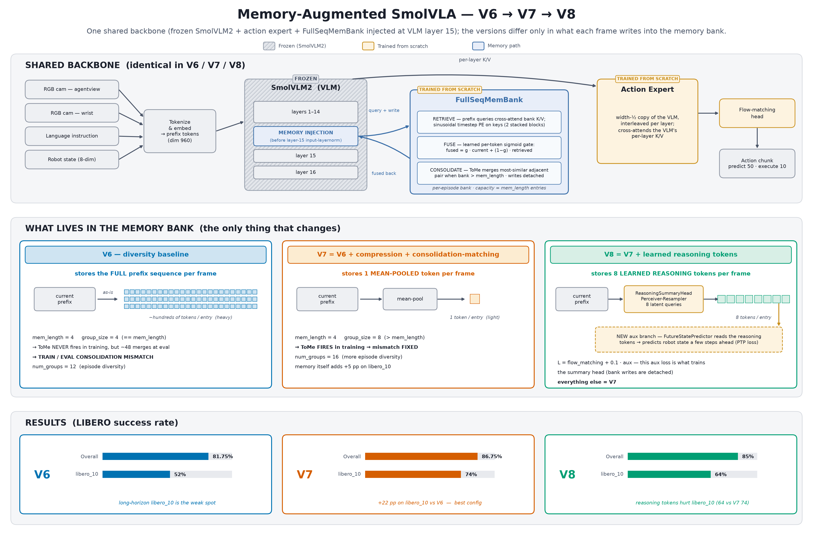

# Memory-Augmented SmolVLA

Adding a trainable temporal **memory system** to [SmolVLA](https://huggingface.co/papers/2506.01844)
(a compact ~0.45B-parameter Vision-Language-Action model) for long-horizon robotic manipulation,
evaluated closed-loop on [LIBERO](https://libero-project.github.io/).

SmolVLA is reactive: every action chunk is predicted from the current camera frames, robot state,
and instruction alone — nothing persists between control steps. This project bolts an episodic
memory bank onto the frozen VLM so the policy can condition on *what it has already seen and done*
this episode. The design is a port of [MemoryVLA](https://arxiv.org/abs/2508.19236)'s `CogMemBank`
into SmolVLA's fused VLM/action-expert architecture, then iterated through five architecture
generations (V6 → V9), **each motivated by a measured failure of the previous one**. This README
describes the latest architecture in depth, the results, and the experimental evidence behind every
design decision.


*Interactive version: [`docs/arch_v6_v7_v8_viewer.html`](docs/arch_v6_v7_v8_viewer.html)*

## Results at a glance

LIBERO success rate, 10 episodes × 10 tasks × 4 suites = 400 rollouts per row, `n_action_steps=10`:

| Config | Overall | spatial | object | goal | libero_10 | Memory net effect¹ |
|---|---:|---:|---:|---:|---:|---:|
| Baseline v2 (no memory, 100k steps) | 87.75 | 84 | 99 | 96 | 72 | — |
| MemoryVLA port @100k (4 eps/batch) | 73.25 | 74 | 96 | 79 | 44 | **−2.75** (harmful) |
| **V6** — episode diversity (12 eps/batch) @65k | 81.75 | 84 | 97 | 94 | 52 | **+3.00** (sign flip) |
| **V7** — compression + consolidation matching @60k | 86.75 | 85 | 99 | 89 | **74** | +1.25 (libero_10 **+5**) |
| **V7 + action ensembling** (test-time only) | **88.75** | 85 | 99 | 95 | **76** | — |
| **V8** — reasoning tokens + PTP aux @60k | 85.0 | **87** | 99 | 90 | 64 | +0.5 (libero_10 **−4**) |
| V8 + action ensembling | 87.0 | 86 | 98 | 96 | 68 | — |
| **V9** — V8 + truncated BPTT through the bank | *training* | | | | | |

¹ mem-on minus `--bypass-memory` on the same checkpoint and seeds: the causal contribution of the
memory pathway.

Three headline claims:

1. **V7 + ensembling (88.75) beats the no-memory baseline (87.75)**, with the largest gain exactly
   where memory should help: long-horizon `libero_10` (72 → 76).
2. The bypass ablation shows memory is **causally positive** from V6 onward (+3.0), after being
   causally *harmful* (−2.75) in the initial port — same architecture, different training data
   layout (§4.3).
3. V8's learned "reasoning token" memory is a clean **negative result on long-horizon** (74 → 64
   on libero_10) with an identified mechanism (myopic tokens, §4.6) that V9 is built to fix.

---

## 1. Architecture in depth

### 1.1 The base model (frozen)

SmolVLA = SigLIP vision encoder + SmolLM2 truncated to **16 transformer layers** (hidden size
960) as the VLM, plus an **action expert**: a width-½ transformer trained with flow matching that
cross-attends to the VLM's K/V. Crucially, the two are **interleaved per layer**, not sequential —
with `self_attn_every_n_layers=2`, the expert cross-attends to same-depth VLM K/V at odd layers
(1, 3, …, 15). The policy predicts a 50-step action chunk; we execute 10 steps then re-query.

Two consequences shape the whole memory design:

- **There is no single "post-VLM" tensor** to augment. MemoryVLA assumes a sequential
  VLM → memory → decoder pipeline; SmolVLA has no such seam. Memory must be injected *inside* the
  VLM layer stack.
- **Truncating SmolLM2 to 16 layers removes any "cognitive token."** MemoryVLA stores the final
  LLM layer's EOS embedding as a distilled semantic summary; a truncated VLM never produces one.
  Our bank must store (or learn to manufacture) its content from intermediate prefix states — this
  gap directly motivates V8 (§4.6).

### 1.2 The injection point — VLM layer 15, before its input-layernorm

Memory is injected at a single point: the **residual-stream prefix hidden state entering VLM
layer 15** (`injection_layer=15`, `inject_before=True`), i.e. after layer 14 writes
`inputs_embeds` and before layer 15's `input_layernorm`. Rationale:

- Layer 15 is the **final expert↔VLM cross-attention handoff**. Injecting there means the last
  (and most action-proximal) handoff sees memory-fused features, while all earlier handoffs see
  vanilla VLM features — the pretrained VLM computation is perturbed as little as possible.
- Injecting on the **un-normalized residual stream** lets the layer's own normalization absorb
  scale differences between current and retrieved features.

Mechanically this is non-trivial: `SmolVLMWithExpertModel.forward()` manually decomposes each
layer (calls `q_proj`, `mlp`, … individually) instead of calling `layer.forward()`, so standard
PyTorch forward hooks **never fire**. `FeatureExtractor`
([`policy/feature_extractor.py`](src/memory_smolvla/policy/feature_extractor.py)) monkey-patches
the forward with an exact replica of the upstream layer loop plus one callback at the injection
point. If upstream lerobot changes that function, the patch must be updated to match.

### 1.3 The memory loop — `FullSeqMemBank`

Every VLM forward on a prefix runs one iteration of **retrieve → fuse → write → consolidate**
([`memory/full_seq_bank.py`](src/memory_smolvla/memory/full_seq_bank.py)), per episode ID:

```
cameras + language + robot state
  └─► frozen SmolVLM2 (16 layers)
        └─► layer 15 residual stream, prefix (L tokens × 960): _memory_callback
              ├─ RETRIEVE  prefix queries the bank via 2 stacked cross-attn blocks
              │            (bank entries flattened to keys/values; sinusoidal
              │             timestep PE added to keys; empty bank → retrieved = current)
              ├─ FUSE      per-token sigmoid gate g = σ(W[current; retrieved]):
              │            fused = g·current + (1−g)·retrieved
              ├─ WRITE     store this frame's content in the per-episode bank
              │            (what gets stored is the version knob — §1.4)
              └─ CONSOLIDATE  if bank > mem_length: ToMe-merge the most-similar
                              adjacent pair (keeps a fixed-size, temporally
                              abstracted history)
        └─► layer 15 self-attn + final norm  (sees fused features)
  └─► action expert cross-attends VLM K/V per layer (layer-15 K/V is memory-fused)
  └─► flow-matching head → 50-step action chunk (execute 10)
```

Components (all trained from scratch; D = 960):

| Module | Role | Params |
|---|---|---:|
| `CrossTransformerBlock` × 2 | retrieval: post-norm cross-attn (SDPA) + 4× FFN | ~20.3M |
| `GateFusion` | `Linear(2D→D)` + sigmoid, init `std=1e-3` → gate starts at 0.5 | ~1.8M |
| `TimestepEmbedder` | sinusoidal timestep → MLP, added to bank **keys** only | ~1.2M |
| `ReasoningSummaryHead` (V8+) | Perceiver-Resampler: 8 learned latents cross-attend the prefix | ~11.1M |
| `FutureStatePredictor` (V8+) | mean-pool tokens → MLP → future proprio state (aux loss only) | ~0.25M |

Details that matter:

- **Bank layout.** `bank[episode_id] = [(timestep, tensor(S, D)), …]`, capacity
  `mem_length=4` entries. `S` is the per-entry token count: full prefix length `L` (V6),
  1 (V7 mean-pool), or `n_slots=8` (V8/V9 reasoning tokens). Retrieval flattens to `T·S` keys, so
  compression is what makes deep banks affordable.
- **Consolidation (ToMe).** On overflow, cosine similarity between adjacent entries picks the pair
  to merge (a discrete choice, under `no_grad`); the merge itself is a 0.5/0.5 average that
  *stays in the autograd graph* when BPTT is on. The bank thus keeps a fixed-size history whose
  entries become increasingly abstract summaries of longer time spans.
- **Cold-start identity.** With an empty bank, `retrieved = current`, so
  `g·current + (1−g)·current = current` exactly — frame 0 of every episode is functionally
  vanilla SmolVLA regardless of gate value.
- **Gate init at the midpoint.** `std=1e-3` init puts the gate at σ(0) ≈ 0.5 (not a
  suppressed-memory init — see §4.2 for why the earlier `bias=-5` init was abandoned).
- **Bypass switch.** `mem_bank.bypass = True` skips retrieval+fusion and returns the prefix
  unchanged — the ablation control behind every "memory net effect" number in this README.
- **KV-cache interaction.** At inference the callback fires once per policy query during the
  prefix/cache-build forward and is a no-op during the 10 flow-matching denoising steps, so the
  bank advances exactly once per query.

### 1.4 What each version stores — the one knob that changed

The loader, retrieval, gate, and ToMe are held fixed from V6 on; the versions differ in **bank
content** (plus V9's gradient path):

| | Bank entry (per frame) | S | Train-time ToMe | Gradients into content |
|---|---|---:|---|---|
| **V6** | raw full VLM prefix | L | never fires (`group_size == mem_length`) | none (detached) |
| **V7** | mean-pooled prefix | 1 | fires (`group_size 8 > mem_length 4`) | none (detached) |
| **V8** | 8 learned reasoning tokens | 8 | fires | PTP aux loss only (same-step) |
| **V9** | 8 learned reasoning tokens | 8 | fires | PTP **+ action loss of later frames via truncated BPTT** |

### 1.5 V8: reasoning tokens + Predictive Token Prediction (PTP) aux loss

V8 ports the one MolmoAct2 idea that attacks a known weakness here
([`V8_PLAN.md`](V8_PLAN.md)): since the truncated VLM has no cognitive token, **manufacture
one**. A `ReasoningSummaryHead` (Perceiver-Resampler,
[`memory/reasoning.py`](src/memory_smolvla/memory/reasoning.py)) turns each frame's prefix into
8 learned tokens, and *those* become the bank content — memory stores "what/where the scene is
about," not pixels.

Because bank writes are detached (no BPTT invariant, pre-V9), the summary head would receive **no
gradient at all** — nothing downstream of storage can reach it. The PTP auxiliary loss closes the
loop in the *same* step's forward: a `FutureStatePredictor` MLP predicts the robot's
proprioceptive state `future_horizon=5` frames ahead from the current reasoning tokens, and the
masked-MSE loss (weight 0.1) is added to the flow-matching loss. The grouped loader emits
per-frame `future_states`/`future_valid` targets for this.

### 1.6 V9 (current): truncated BPTT through the bank

V8's result (§4.6) showed PTP alone shapes the tokens *myopically* — they learn to predict 5
frames ahead, and long-horizon performance regressed. V9 flips one flag (`bptt_memory: true`,
[`configs/memvla_libero_v9.yaml`](configs/memvla_libero_v9.yaml)) that changes where credit flows:

- Stored reasoning tokens **keep their autograd graph** (no `.detach()` on write), and ToMe
  merges average in-graph, so when frame *t+k* retrieves a memory written at frame *t*, frame
  *t+k*'s **action loss backpropagates into the summary head that produced that memory**.
- The VLM input to the summary head is still detached (the VLM is frozen anyway), so the retained
  graph is only the small head — cheap.
- Truncation is the training-group boundary (`group_size=8` contiguous frames): BPTT spans at
  most 8 frames, and the bank is cleared between groups, bounding memory and compute.

The thesis: the summary head should learn to write what *future retrieval finds useful*
(long-horizon credit), not merely what predicts near-future proprioception (PTP stays on as a
regularizer). Everything else — config, data, 60k steps, batch 128 — is V8-identical, so the
comparison isolates the credit-assignment change. Status: training; eval lands via
[`scripts/run_v9_eval_at_60k.sh`](scripts/run_v9_eval_at_60k.sh) into `results/v9_eval/`.

### 1.7 Data pipeline: grouped episode streaming

Memory training needs *temporally ordered frames from the same episode inside one batch* —
standard shuffled sampling destroys exactly the structure the bank feeds on.
`GroupedEpisodeLoader` ([`data/group_loader.py`](src/memory_smolvla/data/group_loader.py)) yields
batches of `num_groups × group_size` frames: each group is `group_size=8` **contiguous** frames
from one episode at a random offset, and `num_groups=16` distinct episodes per batch (batch 128).
Per-frame `episode_ids`/`timesteps` metadata tell the bank which entries belong together; the bank
processes the batch sequentially, clearing each group's episode when the next begins.

`num_groups` is the **episode-diversity knob** — the single most important hyperparameter in the
project's history (§4.3). `group_size > mem_length` is the **consolidation-matching** constraint
(§4.4): it forces the bank to overflow and ToMe to fire during training, as it does at eval.

### 1.8 Training regime

| | |
|---|---|
| Frozen | entire VLM (SigLIP + SmolLM2 16 layers) |
| Trained from scratch | action expert (~98M) + `action_out_proj` + memory stack (~23M V7 / ~35M V8/V9) |
| Trainable total | ~121M of 473M (26%) in V7; ~133M in V8/V9 |
| Loss | flow matching + `0.1 ·` PTP aux (V8/V9) |
| Optimizer | AdamW lr 1e-4 cosine → 2.5e-6, warmup 1000, betas (0.9, 0.95), weight_decay 1e-10, grad-clip 10 |
| Precision | bf16 autocast (no GradScaler), matching baseline v2 |
| Steps / batch | 60k @ batch 128 (16 groups × 8 frames) — ~9.1 s/step, ≈6.3 days on a DGX Spark (GB10, 119 GB unified) |
| Eval box | RTX 5090 (the machine whose pipeline produced the trustworthy baseline numbers) |

Why the expert is trained from scratch rather than finetuned — and why nothing here uses the
finetuned `smolvla_libero` checkpoint — is the project's founding negative result (§4.1).

### 1.9 Inference-time behavior

Per rollout: `policy.reset()` clears the bank and timestep counter; each policy query (every 10
env steps) builds the prefix, fires the memory callback once, and writes one bank entry. A
`libero_10` rollout (520 max steps) makes ~52 queries → ~48 ToMe consolidations, which is why
train/eval consolidation matching (§4.4) matters.

**Test-time action ensembling** (`--ensemble`, ACT-style): keep querying every 10 steps but
retain full 50-step chunks; each executed timestep averages the ~5 overlapping predictions with
exponential age-decay weights (`w ∝ exp(−0.1·age)`), gripper takes the most recent. Bank cadence
is unchanged, so it composes with memory. Zero training, +2pp (§4.5).

---

## 2. Results in depth

### 2.1 Protocol

- 4 suites (libero_spatial / object / goal / libero_10), 10 tasks × 10 episodes each = 400
  rollouts per condition; per-episode env re-instantiation (different init states), suite-native
  max steps (280/280/300/520), `n_action_steps=10`, seeds `start_seed + ep`.
- **Anchored baseline:** our own baseline v2 reproduction (from-scratch expert, 100k steps)
  scores **87.75**, beating the SmolVLA paper's 82.8 under the paper's own `n=10` protocol —
  memory results are compared against this stronger anchor, not the paper number.
- **Pipeline correctness:** lerobot 0.5.1's `LiberoEnv` returns sim frames rotated 180° relative
  to the training data; the eval script applies the flip. Validated by calibration: the base
  no-memory model reads 88% on libero_object through this exact pipeline. (An earlier V7 eval
  without the flip read 58.75 overall — those numbers in `results/v7_eval/` are superseded by
  `results/v7_eval_flip/`.)
- Every checkpoint is evaluated **mem-on and bypass** on the same seeds; the delta is the causal
  memory contribution.

### 2.2 Main table (per-suite, mem-on vs bypass)

| Config | Condition | Overall | spatial | object | goal | libero_10 |
|---|---|---:|---:|---:|---:|---:|
| Baseline v2 | — | 87.75 | 84 | 99 | 96 | 72 |
| Port @100k | mem-on | 73.25 | 74 | 96 | 79 | 44 |
| Port @100k | bypass | 76.00 | 72 | 96 | 82 | 54 |
| V6 @65k | mem-on | 81.75 | 84 | 97 | 94 | 52 |
| V6 @65k | bypass | 78.75 | 77 | 97 | 89 | 52 |
| V7 @60k | mem-on | 86.75 | 85 | 99 | 89 | 74 |
| V7 @60k | bypass | 85.50 | 83 | 100 | 90 | 69 |
| V7 @60k | mem-on + ensemble | **88.75** | 85 | 99 | 95 | 76 |
| V8 @60k | mem-on | 85.00 | 87 | 99 | 90 | 64 |
| V8 @60k | bypass | 84.50 | 84 | 99 | 87 | 68 |
| V8 @60k | mem-on + ensemble | 87.00 | 86 | 98 | 96 | 68 |

Eval gate means (weight on *current* features): ~0.49–0.50 throughout training in every run;
0.455 at V7 eval, 0.416 at V8 eval — memory is mixed in at roughly half weight, never gated off.

### 2.3 What the bypass ablations say

| | mem-on − bypass | spatial | goal | libero_10 | Reading |
|---|---:|---:|---:|---:|---|
| Port @100k | **−2.75** | +2 | −3 | **−10** | memory net-harmful; damage scales with rollout length |
| V6 @65k | **+3.00** | +7 | +5 | 0 | memory net-positive on mid-horizon; long-horizon neutral |
| V7 @60k | **+1.25** | +2 | −1 | **+5** | memory's gain finally lands on long-horizon |
| V8 @60k | +0.50 | +3 | +3 | **−4** | reasoning-token memory helps near-horizon, *hurts* long-horizon |

This progression is the project's core scientific result: the same retrieval/gate/ToMe machinery
goes from net-harmful → net-positive → long-horizon-positive purely through training-distribution
fixes (diversity, consolidation matching), and V8 shows that *content* changes can reintroduce a
horizon-specific failure even when the overall delta stays positive.

### 2.4 V8, read closely (why it's a negative result worth keeping)

V8 vs V7: spatial 85 → 87 (its best-ever spatial), goal 89 → 90, but libero_10 74 → 64. And
within V8, bypassing memory *recovers* libero_10 to 68 — the reasoning-token memory is actively
worse than no memory on long horizons, while being better than no memory on short ones (+3
spatial/goal). That pattern is exactly what a **myopic content head** predicts: tokens optimized
(via PTP, horizon 5) to describe the near future crowd out information that would matter 100+
steps later. The architecture didn't fail; the credit assignment did — hence V9.

---

## 3. Why it looks this way — the failure-driven history

Every load-bearing design choice traces to a measured failure. In order:

### 3.1 Frozen-finetuned-base injection fails catastrophically; offline loss lies (v1–v4 era)

The original skeleton trained *only* memory modules (~0.8% of params) against a frozen,
LIBERO-finetuned SmolVLA, and evaluated by held-out flow-matching loss. It looked fine (−0.3%
loss) and then scored **0/20 in closed-loop sim** while the unmodified base scored 20/20. Even
tiny learned perturbations to intermediate VLM features break an action expert that was never
trained to tolerate them; a gentler joint-finetune variant recovered only 6.7%. Two permanent
rules came out of this: **(a)** sim success is the only metric that counts (held-out loss hid a
100-point collapse), and **(b)** memory must be trained *jointly* with the expert — which is why
every run since trains the expert from scratch alongside memory, from the non-finetuned
`lerobot/smolvla_base`.

### 3.2 Gate design: collapse → midpoint init

The early sigmoid gate with a conservative `bias=-5` init (memory enters at α≈0.007) **collapsed
to α≈3×10⁻⁸ on LIBERO** — and retuning to `bias=-1` didn't help. Diagnosis: LIBERO's
flow-matching loss (~0.09) is ~20,000× smaller than the SO100 debugging dataset's, so gradients
through the gate were proportionally weak and the gate MLP found "suppress memory" before
retrieval learned anything useful. The MemoryVLA-port gate instead initializes at the **sigmoid
midpoint** (`std=1e-3` → g≈0.5): memory participates at 50% from step 1, identity at cold start
is provided structurally (empty bank ⇒ retrieved = current), and the gate has never collapsed
since (0.49–0.50 across all runs).

### 3.3 Episode diversity is the dominant training factor (the sign flip)

The first full port run used 4 episodes per batch (`num_groups=4 × group_size=8`) and landed at
**73.25**, with bypass *beating* mem-on by 2.75 — memory was net-harmful. One change —
`num_groups` 4 → 12 (12 distinct episodes per batch, V6) — produced **81.75** and flipped the
bypass sign to **+3.0**. Nothing about the memory architecture changed. Interpretation: with too
few episodes per gradient step, the expert co-adapts to noisy retrieved features it can't gate
off; at eval the co-adaptation breaks and memory becomes drag. Gradient diversity, not
architecture, was the 8.5-point problem. V7 pushed it to 16 episodes/batch.

### 3.4 Consolidation matching: train the bank state you'll evaluate on (V7's libero_10 fix)

V6 had `group_size == mem_length == 4`, so the bank filled but **never overflowed during
training — ToMe never fired**. At eval, a libero_10 rollout consolidates ~48 times. The model
retrieved from a bank state it had literally never seen in training, and libero_10 (the longest
suite, deepest bank state) was stuck at 52 while shorter suites matched baseline. V7's fix:
`group_size 8 > mem_length 4`, so ToMe fires in training and both train and eval settle at 4
actively-consolidated entries. Combined with mean-pool **compression** (1 token per entry, which
makes the deeper group affordable — retrieval keys scale as T·S, and a learned Perceiver
alternative exists for read-time compression), libero_10 jumped **52 → 74**, within 2 points of
its target, and overall reached 86.75. The V7 bypass delta concentrates on libero_10 (+5): the
first time memory demonstrably helped long-horizon.

### 3.5 Free points at test time: action ensembling

Executing 10 steps of a 50-step chunk leaves seams — actions are stale mid-chunk and jerky at
chunk boundaries, and the errors compound over long rollouts. ACT-style temporal ensembling
(overlapping chunks, exponential-decay averaging) is eval-only and lifted V7 86.75 → **88.75**
(goal +6, libero_10 +2), past the 87.75 baseline. Spatial didn't move — confirming spatial's
residual gap is a grounding problem, not an action-smoothness problem. It composes with every
future checkpoint.

### 3.6 V8's myopia → V9's BPTT

V8 upgraded bank *content* from pooled perception to learned reasoning tokens (§1.5), on the
thesis that the truncated VLM's missing "cognitive token" was capping long-horizon gains. The
result (§2.4): better spatial/goal, worse libero_10, and memory *causally negative* on long
horizon. Mechanism: with bank writes detached, the summary head's **only** training signal was
the PTP loss — predict proprio 5 frames out — so the tokens encoded near-future dynamics and
displaced longer-lived scene information the raw pooled features had carried "for free."
The failure is credit assignment, not content: nothing ever told the head what would be useful to
*remember*. V9 keeps the write graph alive within a training group so later frames' action losses
backprop into the head that wrote the memory they retrieved (§1.6) — long-horizon credit at last,
with PTP retained as a near-horizon regularizer.

### 3.7 What's deliberately *not* here

- **No BPTT before V9, and only truncated BPTT now** — full-episode BPTT through a consolidating
  bank is memory-prohibitive; the group boundary (8 frames) is the truncation.
- **No MolmoAct-style DiT expert / discrete action tokens / depth codebooks** — evaluated and
  rejected as off-thesis: they change the action head, not the memory story
  ([`V8_PLAN.md`](V8_PLAN.md) §2 has the full filter table).
- **No per-layer multi-point injection yet** — single-seam injection keeps the frozen VLM's
  computation maximally intact; multi-layer injection is queued behind a working single-seam
  result.

### 3.8 Transferable lessons

1. **Offline proxy metrics can hide closed-loop catastrophe.** A −0.3% loss "win" was a 100-point
   sim collapse. Evaluate policies in the loop.
2. **Stateful modules must be trained on the state distribution they'll see at eval** —
   consolidation depth was a silent train/eval shift worth ~20 points on libero_10.
3. **Gradient diversity can masquerade as an architecture problem.** The bypass sign flip from
   `num_groups` alone is the cleanest evidence in the project.
4. **Detached memory writes make content heads myopic**: whatever auxiliary loss you attach is
   the *only* thing the content learns to serve. If you want memory useful later, some gradient
   must arrive from later.
5. **Always ship a bypass switch.** Overall averages moved by ±3 while individual suites moved by
   ±10 in opposite directions; only the ablation-controlled per-suite deltas made the mechanisms
   legible.

---

## 4. Using the repo

### Setup

```bash
python3.12 -m venv .venv && source .venv/bin/activate
pip install -e ".[dev,libero]"          # libero extra pulls the sim stack for eval
```

Training runs on an NVIDIA DGX Spark (GB10, aarch64, PyTorch cu128); eval runs on an RTX 5090 box.

### Train

```bash
python scripts/train.py --config configs/memvla_libero_v9.yaml   # or _v7 / _v8
# long unattended runs use the auto-resume supervisor:
nohup bash scripts/run_v9_supervised.sh configs/memvla_libero_v9.yaml > .train_v9.log 2>&1 &
```

### Evaluate (LIBERO closed-loop sim)

```bash
MUJOCO_GL=glfw python scripts/eval_memory_libero.py \
    --checkpoint checkpoints/memvla_libero_v9/final.pt \
    --config configs/memvla_libero_v9.yaml \
    --all-suites --n-episodes 10 \
    [--bypass-memory] [--ensemble --query-every 10 --ensemble-decay 0.1]
```

`--bypass-memory` disables the memory pathway (the ablation control); `--ensemble` enables
ACT-style temporal action ensembling. Sanity checks: `pytest tests/` (bank shapes, episode
isolation, consolidation, gradient flow, cold-bank identity, reasoning heads, future targets)
and `ruff check src/ tests/ scripts/`.

### Layout

```
src/memory_smolvla/
├── memory/          full_seq_bank.py (bank + ToMe + BPTT switch) · blocks.py (retrieval,
│                    gate, timestep PE) · compressor.py (Perceiver) · reasoning.py (V8 heads)
├── policy/          memory_smolvla.py (wrapper) · feature_extractor.py (layer-15 patch)
│                    · builder.py (loads smolvla_base, reinits expert)
├── data/            group_loader.py (grouped episode streaming + future-state targets)
└── training/        trainer.py (bf16 AMP loop, two param groups) · config.py
configs/             memvla_libero_v{7,8,9}.yaml + smoke/sweep variants
scripts/             train / eval_memory_libero (bypass + ensemble) / calibrate / supervisors
results/             per-suite eval JSONs (v7_eval_flip, v8_eval*, v9_* are canonical)
docs/                architecture diagram (PNG + interactive viewer)
```

### Version & artifact index

| Version | Config | Design doc | Canonical results |
|---|---|---|---|
| port @100k | `memvla_libero.yaml` | [`STATUS_REPORT.md`](STATUS_REPORT.md) §3.8–3.9 | `results/sim_memory/` |
| V6 diversity | `memvla_libero_diversity.yaml` | [`STATUS_REPORT.md`](STATUS_REPORT.md) §3.10 | `results/sim_memory/*diversity*` |
| V7 | `memvla_libero_v7.yaml` | [`V7_RUN_PLAN.md`](V7_RUN_PLAN.md) | `results/v7_eval_flip/`, ensemble in `results/v9_ensemble/` |
| V8 | `memvla_libero_v8.yaml` | [`V8_PLAN.md`](V8_PLAN.md) | `results/v8_eval/`, `results/v8_eval_ensemble/` |
| V9 | `memvla_libero_v9.yaml` | [`V9_PLAN.md`](V9_PLAN.md) | `results/v9_eval/` (pending) |

Pre-pivot history (v1–v4 skeleton, SO100 ablations, gate-collapse forensics, baseline
reproduction) is preserved in [`STATUS_REPORT.md`](STATUS_REPORT.md) §2–3.7.

## References

- **SmolVLA** — Shukor et al., 2025 ([paper](https://huggingface.co/papers/2506.01844)) — base model.
- **MemoryVLA** — `CogMemBank` design this project ports (bank / cross-attn retrieval /
  gate fusion / temporal PE).
- **ToMe** — Bolya et al., 2022 — token-merge consolidation.
- **ACT** — Zhao et al., 2023 — temporal action ensembling.
- **Flamingo / Perceiver-Resampler** — Alayrac et al., 2022 — compression & reasoning-token head.
- **MolmoAct** — source of the intermediate-reasoning-tokens idea adapted in V8.
- **LIBERO** — Liu et al., 2023 — benchmark.
