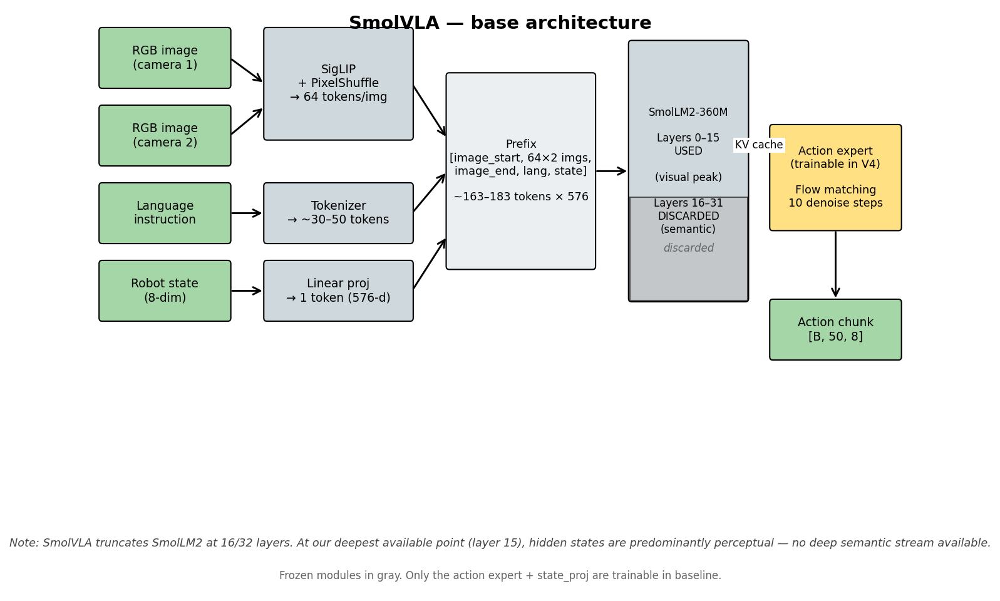
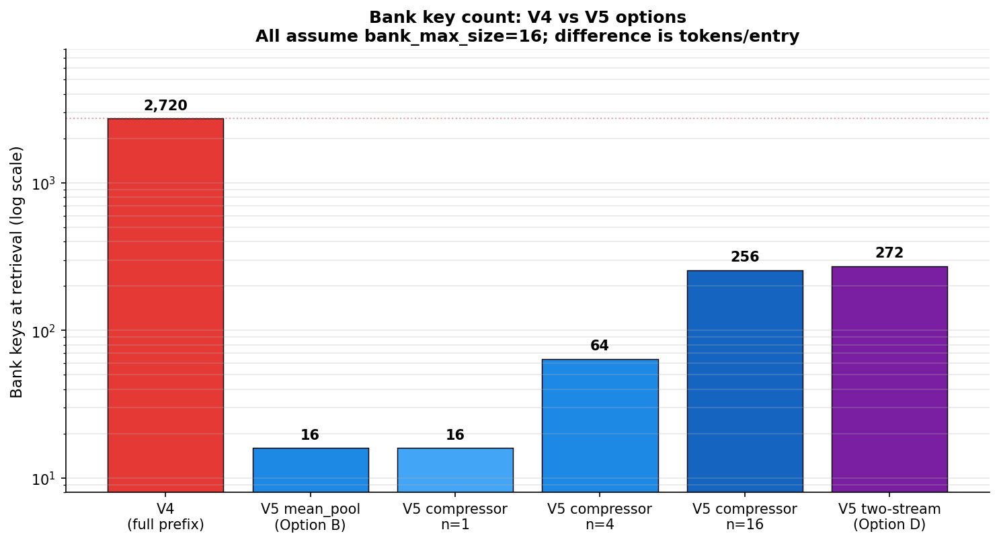
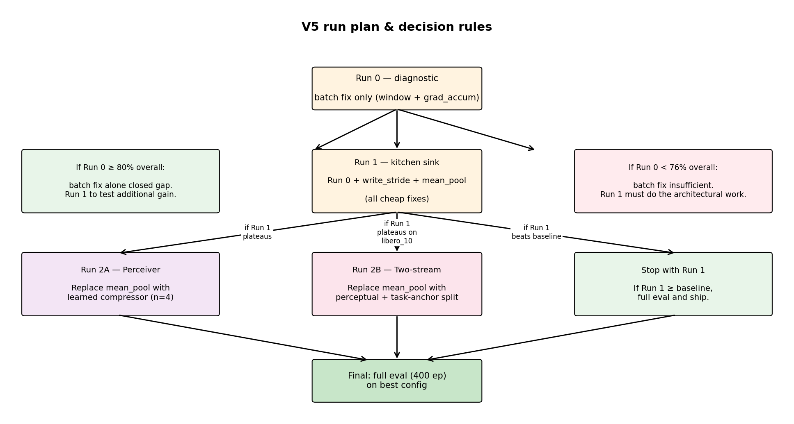

A comprehensive technical document covering the project's motivation, the SmolVLA and MemoryVLA reference architectures, our V4 implementation in full, the training and evaluation methodology, the five drawbacks we discovered, and the V5 fixes that address each.

\newpage

## 1. Motivation

### 1.1 Why robotic VLAs underperform on long-horizon tasks

Vision-Language-Action (VLA) models like SmolVLA, OpenVLA, π-0, and CogACT are **Markovian by construction**. Each forward pass conditions on the current frame's observation only — the policy is `π(a_t | o_t, l)` where `o_t` is the current image+state and `l` is the language instruction. There is no architectural place where information from `o_{t-1}, o_{t-2}, ...` enters the decision.

For short-horizon tasks (pick up cube, place in bin, open drawer) this is fine because the visible scene state is a sufficient statistic. For long-horizon tasks (re-arrange objects in a specific sequence, return-to-start-position behaviors, "place it in the box you just opened") the right action depends on facts that are no longer in the current frame: *which* container was opened, *which* object was already placed, *whether* the gripper has cycled.

**Empirical signature in our own runs.** SmolVLA's weakest LIBERO suite by far is `libero_10`, the long-horizon suite explicitly designed around tasks where temporal context matters. From our v2 baseline reproduction:

| Suite | Task type | Our v2 (87.75% overall) | Paper Table 13 |
|---|---|---:|---:|
| libero_spatial | Single-step pick-and-place with spatial constraints | 84% | 89% |
| libero_object | Single-step picking from object set | 99% | 94% |
| libero_goal | Goal-conditioned single-step | 96% | 91% |
| libero_10 | **10-step long-horizon sequences** | **72%** | **57%** |

Object and goal saturate; libero_10 has the largest headroom by a wide margin. This is precisely the suite we expect a memory-augmented VLA to most improve.

### 1.2 Why retrofit memory rather than retrain from scratch

Training SmolVLA from scratch with a temporal context window would mean reconstructing the entire VLM + action expert + flow matching pipeline at higher cost. Two recent papers show that **adding memory to a frozen VLA backbone** — without retraining anything except the memory module itself — recovers most of the long-horizon gap:

- **MemoryVLA** ([arXiv:2508.19236](https://arxiv.org/abs/2508.19236), Aug 2025) reports +26pp on long-horizon real-world manipulation vs the CogACT baseline they retrofit. They achieve 84.0% overall real-world success, 96.5% on LIBERO-5.
- **ContextVLA** ([arXiv:2510.04246](https://arxiv.org/abs/2510.04246), Oct 2025) achieves consistent improvements over single-frame VLAs by injecting a single average-pooled context token per past frame at the 2nd VLM block. ~2.4× faster inference than running multi-frame at full resolution.

Both freeze the VLA backbone and train only the memory module. This is the architectural pattern this project adopts.

### 1.3 Project goal (concrete)

Add a temporal memory module to the SmolVLA pipeline such that:

1. **The base SmolVLA is fully frozen** — VLM weights never update. Action expert may be jointly finetuned to absorb memory perturbations, but at low LR.
2. **Memory parameter count < 1% of total** — a 450M VLA stays ~450M; the memory module adds ~10M params at most.
3. **`libero_10` recovers ≥ +10pp** vs baseline (target 82%+, baseline 72%).
4. **Suites that already saturate don't degrade** — `libero_object` stays ≥97%.
5. **Training fits in ≤12h on Colab L4** so we can iterate weekly.

---

## 2. SmolVLA architecture

Reference: [arXiv:2506.01844](https://arxiv.org/abs/2506.01844). Implementation: [github.com/huggingface/lerobot](https://github.com/huggingface/lerobot/tree/main/src/lerobot/policies/smolvla).

{width=95%}

### 2.1 Components

| Component | Role | Specs |
|---|---|---|
| **SigLIP** vision encoder | RGB -> patch tokens | 512×512 input -> SigLIP base -> PixelShuffle -> **64 tokens per image**, 576 dim |
| **SmolLM2-360M** language model | Text + image fusion via decoder-only attention | Original 32 layers; **SmolVLA truncates to first 16** |
| **Action expert** (`lm_expert`) | Generates action chunks via flow matching | Cross-attends to VLM hidden-state KV cache; `expert_width_multiplier=0.75` -> hidden dim 432; interleaved self/cross-attn |
| **Action output projection** (`action_out_proj`) | Linear head | 432 -> action_dim (8 for LIBERO 7-DoF + gripper) |
| **State projection** (`state_proj`) | Robot proprioception -> token | Linear from 8-dim state -> 576-dim token |

### 2.2 Prefix construction (the input the VLM sees)

`embed_prefix` in `modeling_smolvla.py` builds the VLM input embeddings in this order:

```
[image_start_token]
[64 image tokens, camera 1]
[image_end_token]
[image_start_token]
[64 image tokens, camera 2]
[image_end_token]
[language tokens, padded to longest in batch]
[1 state token]
```

For LIBERO `smolvla_libero` (2 cameras: agentview + robot0_eye_in_hand, `add_image_special_tokens=True`):

| Region | Token count | Notes |
|---|---:|---|
| Image specials (start + end) per camera | 2 × 2 = 4 | Boundary markers |
| Image content | 2 × 64 = 128 | Each image PixelShuffle'd to 64 tokens |
| Language (instruction) | ~30–50 | Padded to longest in batch (`pad_language_to=longest`) |
| State | 1 | Single linear projection of robot pose |
| **Total prefix length L_prefix** | **~163–183** | Bank entries are shaped `[L_prefix, 576]` in V4 |

All tokens are 576-dim (SmolLM2's hidden size).

### 2.3 The truncation — why it matters for memory design

SmolVLA uses **only the first 16 of SmolLM2's 32 layers** (`num_vlm_layers=16` in the config). This is a deliberate efficiency choice: the layers above 16 contribute little to action accuracy on robotics data, and dropping them halves VLM forward cost.

Standard interpretability finding for autoregressive multimodal LLMs:
- **Early layers (0–8)**: low-level visual + lexical features
- **Middle layers (8–16)**: object-level visual representations peak; partial cross-modal mixing
- **Upper layers (16–32, REMOVED)**: semantic abstraction, intent representation, task understanding

**Implication for memory.** At our deepest available injection point (layer 15), hidden states are predominantly perceptual. A "synthetic [SUMMARY] token" that relies on the LLM doing semantic aggregation via attention is weakened, because the layers that would *do* that aggregation have been discarded. This forces our memory design to assume only a perceptual stream is available — distinct from MemoryVLA, which has full LLaMA-7B (32 layers) and can extract a true cognitive token at the EOS position of the final layer.

### 2.4 Action expert and flow matching

The action expert is a **second transformer** that runs in parallel to the VLM during the forward pass:

```python
# inside SmolVLMWithExpertModel.forward (paraphrased)
for layer_idx in range(num_vlm_layers):
    # VLM stream: prefix hidden states
    # Expert stream: noisy action tokens during denoising
    if (fill_kv_cache or layer_idx % self_attn_every_n_layers == 0):
        # Self-attention layer (both streams attend within themselves)
        att_outputs = forward_attn_layer(...)
    else:
        # Cross-attention layer (expert attends to VLM KV cache)
        att_outputs = forward_cross_attn_layer(...)
```

Key SmolVLA settings (see `configuration_smolvla.py`):
- `attention_mode="cross_attn"` — interleaved self/cross attention
- `self_attn_every_n_layers=2` — every other layer is cross-attention
- `chunk_size=50` — predict 50-step action chunks
- `num_steps=10` — 10 denoising steps in flow matching

**Flow matching loss.** During training, a noise-action pair `(a_noisy, a_clean)` and time `t ∈ [0, 1]` are sampled; the expert predicts the velocity field `v_θ(a_noisy, t)` and is supervised toward `(a_clean - a_noisy) / (1 - t)`. At inference, 10 Euler steps integrate `v_θ` from pure noise to a clean action chunk.

### 2.5 Inference: action chunking

`SmolVLAPolicy.select_action` maintains an internal action queue:

```python
def select_action(self, batch):
    if self._action_queue.empty():
        action_chunk = self.predict_action_chunk(batch)  # runs VLM forward
        # Push first n_action_steps actions
        for action in action_chunk[:n_action_steps]:
            self._action_queue.append(action)
    return self._action_queue.popleft()
```

For our setup, `n_action_steps=10`. So:
- Every 10 env steps, `predict_action_chunk` fires -> one VLM forward -> 50 actions predicted -> 10 are queued and executed -> repeat.

**Critical for memory.** The memory callback only fires inside `predict_action_chunk`'s forward pass. Between chunks, the VLM is *not* re-run; only queued actions execute. This means **the callback fires ~once per 10 env steps at inference**, not every frame.

(Note: the original SmolVLA paper's table shows `n_action_steps=50` as the default, where the entire chunk is consumed before regenerating. Our v2 baseline uses `n_action_steps=10` because Table 13 shows it improves performance — 87% vs 51%. We will discuss the implications for memory bank fill rate in §5.2 and §6.2.)

---

## 3. MemoryVLA architecture

Reference: [arXiv:2508.19236](https://arxiv.org/abs/2508.19236), [project page](https://shihao1895.github.io/MemoryVLA/), [OpenReview submission](https://openreview.net/forum?id=54U3XHf7qq).

{width=98%}

### 3.1 Components

| Component | Specs |
|---|---|
| **Vision encoders** | DINOv2 + SigLIP, parallel, both frozen |
| **SE bottleneck** | Squeeze-and-Excitation compression: concat(DINOv2, SigLIP) features -> **256 perceptual tokens** of dim `d_p` |
| **Language model** | LLaMA-7B, full 32-layer stack, frozen |
| **Cognitive token extraction** | Output at the EOS-position of LLaMA's final layer = **1 token** of dim `d_c` |
| **Action expert** | Diffusion transformer with two attention layer types per block: perception-attention + cognition-attention |
| **Memory bank** | Two parallel banks ("Perceptual-Cognitive Memory Bank" / PCMB) |

### 3.2 Two-stream working memory

At each timestep, the VLM produces two things:
- **Perceptual tokens** `p ∈ ℝ^{N_p × d_p}` with `N_p = 256`. Computed from raw vision features *before* LLM processing — they bypass LLaMA entirely.
- **Cognitive token** `c ∈ ℝ^{1 × d_c}`. The hidden state at the EOS position after LLaMA's full forward pass. Carries high-level semantic abstraction of the current scene+instruction.

These together form **working memory**: the immediate, short-term representation of the current step.

### 3.3 The memory bank (PCMB)

Two parallel banks:
- `m^{per} = {m_i^{per} ∈ ℝ^{N_p × d_p}}_{i=1}^L` — past perceptual tokens, up to `L` entries
- `m^{cog} = {m_i^{cog} ∈ ℝ^{1 × d_c}}_{i=1}^L` — past cognitive tokens, up to `L` entries

**Write.** Each timestep, current `(p, c)` is written to the respective banks (detached, no BPTT).

**Consolidation.** When a bank exceeds capacity `L`: compute pairwise similarities between adjacent entries (cosine similarity on mean-pooled features), find the most-similar pair, average their tensors, keep the newer timestamp.

**Read.** For each stream:
1. Add sinusoidal **timestep positional encoding** `TE(t)` to the bank keys (not values).
2. Cross-attention: `H^x = Attention(query=x, key=m^x + TE, value=m^x)` for `x ∈ {per, cog}`.
3. Two transformer layers refine each `H^x`.

### 3.4 Gate fusion and injection

For each stream, a learned sigmoid gate fuses retrieved features with current:

```
g^x = σ(MLP(concat[x, H^x]))
x̃ = g^x ⊙ H^x + (1 - g^x) ⊙ x
```

`x̃^{per}` and `x̃^{cog}` are both passed forward to the action expert. The action expert has **two distinct attention layer types**:
- **Perception-attention layers** condition on `x̃^{per}` (256 tokens)
- **Cognition-attention layers** condition on `x̃^{cog}` (1 token)

These alternate (or stack) inside the diffusion transformer blocks. The cognitive layer is responsible for high-level "what should happen next" reasoning; the perceptual layer is responsible for fine-grained spatial understanding.

### 3.5 Why this approach doesn't directly transfer to SmolVLA

Three structural differences matter:

1. **No deep semantic stream.** MemoryVLA's cognitive token comes from layer 32 of LLaMA-7B. SmolVLA truncates to layer 16 of SmolLM2-360M. The "cognitive abstraction" layers don't exist in our pipeline.
2. **Perceptual stream operates *before* the LLM.** MemoryVLA bypasses LLaMA for the perceptual side. In our pipeline, by the time we have hidden states, image tokens have already mixed with text tokens via SmolLM2's self-attention. We can't cleanly separate "raw perceptual" from "text-mixed perceptual."
3. **Single injection point in our action expert.** SmolVLA's expert wasn't designed with two attention types. We'd need to architecturally split the expert (large change to a frozen pretrained module) or fuse both streams before injection (loses the benefit of two streams).

These constraints inform our V5 design: we treat the entire VLM hidden state as a **single perceptual stream**, with options to split it positionally (image region vs text region) into a "perceptual + task-anchor" structure that approximates MemoryVLA's two-stream setup at our truncation depth.

---

## 4. Our V4 implementation (current state)

{width=98%}

### 4.1 High-level data flow

```
                                 ┌────────────────────────────────────┐
                                 │ SmolLM2 layers 0–7 (frozen)        │
                                 │ Process prefix into hidden states  │
                                 └────────────────┬───────────────────┘
                                                  ▼
                                  Hidden states at layer 8: [B=1, L_prefix, 576]
                                                  │
                                                  ▼
                                       ╔═══════════════════════╗
                                       ║   Memory Module       ║
                                       ║                       ║
                                       ║   (1) READ from bank  ║
                                       ║       cross-attn      ║
                                       ║   (2) FUSE via gate   ║
                                       ║       (residual)      ║
                                       ║   (3) WRITE to bank   ║
                                       ║       (detached)      ║
                                       ╚═══════════════════════╝
                                                  │
                                                  ▼
                                  Augmented hidden states: [B=1, L_prefix, 576]
                                                  │
                                                  ▼
                                 ┌────────────────────────────────────┐
                                 │ SmolLM2 layers 9–15 (frozen)       │
                                 │ Process augmented prefix           │
                                 └────────────────┬───────────────────┘
                                                  ▼
                                       VLM KV cache (final hidden states)
                                                  │
                                                  ▼
                                 ┌────────────────────────────────────┐
                                 │ Action expert (TRAINABLE in v4)    │
                                 │ Cross-attends to KV cache          │
                                 │ Flow-matching denoising            │
                                 └────────────────┬───────────────────┘
                                                  ▼
                                       Action chunk [B, 50, 8]
```

### 4.2 The injection problem and FeatureExtractor

This is the trickiest implementation detail in the project. **`SmolVLMWithExpertModel.forward` does NOT call `decoder_layer.forward()`.** It manually decomposes each transformer layer:

```python
# pseudocode of what SmolVLA does internally
for layer_idx in range(num_vlm_layers):
    layer = model.text_model.layers[layer_idx]
    # Manually call:
    att_output = forward_attn_layer(...)  # reaches into layer.self_attn
    out = layer.self_attn.o_proj(att_output)
    out += hidden_states  # residual
    after_first_residual = out.clone()
    out = layer.post_attention_layernorm(out)
    out = layer.mlp(out)
    out += after_first_residual
    hidden_states = out
```

Because this loop never calls `layer.forward()`, **PyTorch `register_forward_hook` on the layer module does not fire**. The standard injection mechanism is unavailable.

**Solution: `FeatureExtractor` monkey-patches `vlm_with_expert.forward`** with an exact replication of the upstream loop, plus a single callback fire point at the configured `injection_layer`:

```python
def _patched_forward(self, ...):
    for layer_idx in range(num_layers):
        if self._inject_before and layer_idx == self._injection_layer:
            inputs_embeds[0] = self._callback(inputs_embeds[0], layer_idx)

        att_outputs = ...  # same as upstream
        # ... post-attention, MLP, residual ... (replicated exactly)

        if not self._inject_before and layer_idx == self._injection_layer:
            inputs_embeds[0] = self._callback(inputs_embeds[0], layer_idx)
```

Crucially:
- When **no callback is set**, the patched forward produces bit-identical output to the original (we tested this).
- The patched forward replicates `smolvlm_with_expert.py` lines 404–499 of the upstream LeRobot code. **If LeRobot updates that file, the patched forward must be updated to match.**
- `inject_before=True` is supported for the case where memory should fire before the layer's attention (used for the very last layer 15, so memory features enter the KV cache that the action expert sees).

### 4.3 Memory bank specification

`MemoryBank` ([src/memory_smolvla/memory/bank.py](src/memory_smolvla/memory/bank.py)):

| Property | Setting |
|---|---|
| Storage | `list[(timestamp: int, tokens: Tensor[N_tokens, 576])]` on **CPU**, detached |
| Default capacity | `bank_max_size=16` |
| Eviction (default) | **FIFO** — drop oldest entry when full |
| Eviction (alternative) | **Consolidate** — merge most-similar pair (cosine similarity on mean-pooled features); average tensors, keep newer timestamp |
| Detached writes | `tokens.detach().cpu()` always — no gradient flow into stored entries -> no BPTT through bank |
| Reset | `reset()` clears the list; called at episode boundaries |

**Why CPU storage.** Bank lives across many timesteps; keeping detached tensors on GPU would consume VRAM proportional to bank size × token count × 576 × 4 bytes. For full-prefix V4: 16 × 170 × 576 × 4 ≈ 6 MB. Small, but every megabyte matters when we want batch=32. CPU storage moves the cost off the GPU.

**Why detached.** The bank is supposed to be *read-only* state from past timesteps, not a differentiable history. If we kept gradients flowing back into bank entries, every gradient step would BPTT through the entire episode — quadratic memory and compute cost in episode length. Detaching means each gradient step's backward pass only flows through the *current* timestep's retrieve+gate computation.

### 4.4 Cross-attention retrieval

`CrossAttentionRetrieval` ([src/memory_smolvla/memory/retrieval.py](src/memory_smolvla/memory/retrieval.py)):

```python
def forward(self, current_tokens, memory_tokens, time_deltas):
    time_pe = self.temporal_pe(time_deltas)        # [B, M, D]
    memory_keys = memory_tokens + time_pe          # PE on keys only
    retrieved, _ = self.cross_attn(
        query=current_tokens,                      # current prefix [B, L, D]
        key=memory_keys,                           # memory + PE [B, M, D]
        value=memory_tokens,                       # memory clean [B, M, D]
    )
    return self.norm(retrieved)
```

Key design choices:
- **`nn.MultiheadAttention(d_model=576, num_heads=4, batch_first=True)`** — standard scaled dot-product attention.
- **Temporal PE on keys only, not values.** Attention weights become time-aware; retrieved content stays clean (no PE leakage into the output stream).
- **Single LayerNorm** on the output.

### 4.5 Temporal positional encoding

`TemporalPositionalEncoding` ([src/memory_smolvla/memory/temporal_pe.py](src/memory_smolvla/memory/temporal_pe.py)):

```python
half_dim = d_model // 2
freq_exponents = torch.linspace(0.0, 1.0, half_dim)
periods = min_period * (max_period / min_period) ** freq_exponents  # log-spaced
freqs = 2π / periods

def forward(time_deltas):  # time_deltas: [B, K]
    angles = time_deltas.unsqueeze(-1).float() * freqs  # [B, K, half_dim]
    pe = concat([sin(angles), cos(angles)], dim=-1)     # [B, K, d_model]
    return pe
```

Defaults: `min_period=1, max_period=1000`, `d_model=576`. The PE basis covers time deltas up to ~1000 in well-behaved sin/cos values. **However, the PE values for any given delta are only "trained" if the gate/retrieval modules saw that delta during training** — the basis being defined ≠ the model knowing how to use it. This is the source of Drawback 2 (§5.2).

### 4.6 The gate

Two implementations available:

**`SigmoidGate`** ([src/memory_smolvla/memory/gating.py:38](src/memory_smolvla/memory/gating.py:38)):

```python
combined = concat([current, retrieved], dim=-1)            # [B, L, 2D]
alpha = self.gate_mlp(combined)                             # [B, L, 1] in [0, 1]
fused = alpha * retrieved + (1 - alpha) * current
```

Convention: `α = 1 -> all retrieved`, `α = 0 -> all current` (memory bypassed).

The gate MLP: `Linear(2D, hidden_dim=256)` -> `SiLU` -> `Linear(256, 1)` -> `Sigmoid`.

**Initialization tricks:**
- The final `Linear(256, 1)` layer is initialized with `weight=0, bias=-5.0`. Sigmoid(−5) ≈ 0.007. So at init, α ≈ 0.007 -> fused ≈ current.
- `memory_proj` (a `Linear(D, D, bias=False)` between retrieval and gate) is **zero-initialized**.
- Combined: at training step 0, the model's output is **bit-identical to vanilla SmolVLA**. Gradients then push α and `memory_proj` away from zero only as memory becomes useful.

This is the "identity-at-init" property — it's what makes the memory module safe to plug into a pretrained model without immediate destabilization.

**`ResidualGate`** ([src/memory_smolvla/memory/gating.py:18](src/memory_smolvla/memory/gating.py:18)):

```python
fused = current + retrieved
alpha = ones_like(...)  # for logging compatibility
```

No learned gate. The model controls memory contribution entirely through `memory_proj`. At init, `memory_proj` is zero so the residual adds nothing -> identity. As training progresses, `memory_proj` learns the right magnitude.

V4 uses `ResidualGate` because v3 with SigmoidGate observed gate collapse to α≈0 on LIBERO (low-loss regime where the model preferred to ignore memory entirely). Residual avoids the collapse failure mode but loses the gating ability — memory is always-on once `memory_proj` learns non-trivial weights.

**Optional regularization (sigmoid only).** `alpha_reg_weight * (alpha - alpha_target)^2` can be added to encourage moderate α values. V4 doesn't use this.

### 4.7 The complete memory callback

`_episodic_callback` in [src/memory_smolvla/policy/memory_smolvla.py:396](src/memory_smolvla/policy/memory_smolvla.py:396) — V4 form (before V5 changes):

```python
def _episodic_callback(self, prefix_hidden, layer_idx):
    # prefix_hidden: [B=1, L_prefix, 576]
    B, L, D = prefix_hidden.shape
    current_time = self._timestamp
    prefix_compute = prefix_hidden.to(compute_dtype)

    # Step 1: READ
    if len(self.memory_bank) > 0:
        memories, timestamps = self.memory_bank.read_all(device=device)
        # memories: [K, N_tok, D]  timestamps: [K]
        time_deltas = (current_time - timestamps).float()
        memory_flat = memories.reshape(K * N_tok, D)
        memory_batch = memory_flat.unsqueeze(0)  # [1, K*N_tok, D]
        time_deltas_expanded = time_deltas.repeat_interleave(N_tok)
        time_deltas_batch = time_deltas_expanded.unsqueeze(0)

        retrieved = self.retrieval(prefix_compute, memory_batch, time_deltas_batch)
        retrieved = self.memory_proj(retrieved)  # zero-init at start
        fused, alpha = self.gate(current=prefix_compute, retrieved=retrieved)
    else:
        # First timestep: pass zeros through gate so gradients flow
        retrieved = self.memory_proj(torch.zeros_like(prefix_compute))
        fused, alpha = self.gate(current=prefix_compute, retrieved=retrieved)

    # Step 2: WRITE
    for b in range(B):
        tokens_to_store = prefix_hidden[b]  # [L_prefix, D]
        self.memory_bank.write(tokens=tokens_to_store, timestamp=current_time)

    # Step 3: ADVANCE
    self._timestamp += self._step_increment

    return fused.to(orig_dtype)
```

Three things to note:
- **First-timestep fix.** When the bank is empty, we still pass `memory_proj(zeros)` through the gate. This was a bug fix: if we returned `prefix_hidden` unchanged on the first step, the gate/proj/retrieval modules were disconnected from the computation graph and got zero gradients on that step. The zero-tensor path keeps the graph connected so gradients flow even with no memory entries.
- **Mixed precision.** VLM runs in bf16; memory modules can be fp32. Explicit `.to(compute_dtype)` on entry, `.to(orig_dtype)` on exit. Without these casts, dtype mismatches crashed the forward pass.
- **B=1 assertion.** Memory bank state is a per-episode singleton. Cannot batch across episodes. If `B > 1`, raise `NotImplementedError`. This is the constraint that drives Drawback 3.

### 4.8 Trainable parameters in V4

V4 uses `training_mode = "expert_finetune"`. The trainable set:

| Component | Param count (approx) | Purpose |
|---|---:|---|
| `retrieval` (CrossAttentionRetrieval) | ~1.3M | Learn what to attend to in the bank |
| `gate` (ResidualGate) | 0 | No params |
| `memory_proj` (Linear) | ~330K | Learn memory contribution magnitude (zero-init) |
| `lm_expert` parameters | ~150M | Joint finetune of action expert |
| `action_out_proj` | ~3K | Joint finetune of output head |
| **VLM (SmolLM2 + SigLIP)** | **~250M FROZEN** | Never updates |
| **Total trainable** | **~152M** | ~33% of full model |

Note: `memory_proj` gets a 10× lower LR than other memory modules (`memory_proj_lr = memory_lr / 10`) to prevent it from saturating before the rest of the memory pathway has converged.

### 4.9 V4 training configuration

From [configs/libero_injection_half_v4.yaml](configs/libero_injection_half_v4.yaml):

```yaml
policy:
  training_mode: expert_finetune
  base_checkpoint: HuggingFaceVLA/smolvla_libero  # Pretrained on LIBERO
  num_vlm_layers: 16
  injection_layer: 8                               # Mid-VLM
  bank_max_size: 16
  retrieval_n_heads: 4
  gate_type: residual

trainer:
  total_steps: 30000
  memory_lr: 1.0e-4
  expert_lr: 1.0e-5                                # 10x smaller, gentle finetune
  warmup_steps: 500
  weight_decay: 1.0e-4
  max_grad_norm: 1.0
  grad_accum_steps: 1                              # <- DEFAULT, NEVER OVERRIDDEN
  checkpoint_every: 5000
  device: cuda
  # batch_size: 32                                 # <- UNUSED for sequential mode
  wandb_project: null                              # No W&B for v4
```

The `batch_size: 32` field is read into `TrainerConfig` but is **only consulted by `_train_batch`**, which fires for `expert_only_scratch` mode. Our `expert_finetune` mode goes through `_train_sequential`, where the only batch-size-equivalent knob is `grad_accum_steps`. This is one of the central findings of the project (see §5.3).

---

## 5. Training methodology in detail

This section is deliberately exhaustive because the training mechanics turned out to contain the dominant performance issue (Drawback 3).

### 5.1 Training modes — what they unlock

`MemorySmolVLAPolicy` supports four training modes. Each unfreezes a different parameter set:

| Mode | Trainable | Loader | Use case |
|---|---|---|---|
| `memory_only` | Memory modules only (retrieval, gate, memory_proj, optional compressor/write_gate) | Sequential | Train memory against a fully-frozen pretrained policy. Cheapest. |
| `expert_finetune` | Memory + lm_expert + action_out_proj | Sequential | **V4 mode**. Joint finetune so expert can absorb memory perturbations. |
| `expert_scratch` | Memory + lm_expert (random-init) + action_out_proj | Sequential | Build expert from scratch with VLM frozen + memory active. Used for layer-count ablations. |
| `expert_only_scratch` | lm_expert + action_out_proj only (no memory) | **Random** | The baseline path — no memory at all. **V2 baseline used this.** |

### 5.2 The two training loops

`MemorySmolVLATrainer.train` dispatches based on mode:

```python
def train(self):
    if self.cfg.training_mode in {"memory_only", "expert_scratch", "expert_finetune"}:
        self._train_sequential()
    else:
        self._train_batch()
```

**`_train_sequential`** ([trainer.py:112](src/memory_smolvla/training/trainer.py:112)):

```python
def _train_sequential(self):
    self.optimizer.zero_grad()
    accum_count = 0

    for item in self.train_loader:
        if self._step >= self.cfg.total_steps:
            break

        if isinstance(item, EpisodeBoundary):
            # Episode finished — flush partial accumulation, reset memory
            if accum_count > 0:
                self._optimizer_step()
                self._step += 1
                accum_count = 0
            self.policy.reset_memory()  # clears bank, zeroes timestamp
            continue

        batch = self._to_device(item)            # B=1 frame
        loss, loss_dict = self.policy(batch)     # forward through memory pathway
        (loss / self.cfg.grad_accum_steps).backward()
        accum_count += 1

        if accum_count >= self.cfg.grad_accum_steps:
            self._optimizer_step()
            accum_count = 0
            self._step += 1
```

**Key facts about `_train_sequential`:**
1. **Each policy call processes ONE frame** (B=1, asserted in `_memory_callback`). There is no "batch dimension" in the conventional sense.
2. **`grad_accum_steps` is the only effective-batch knob.** Default = 1. With `grad_accum_steps=N`, N sequential frames' gradients are accumulated before an optimizer step.
3. **EpisodeBoundary triggers two things**: an early optimizer step (flushing partial accumulation) AND a memory reset. The early step was a recent bug fix — without it, gradients from the last partial-accum group of episode A would carry into episode B's accumulation, mixing data.
4. **`policy.reset_memory()` does:** `memory_bank.reset()` (clear list) + `_timestamp = 0` + clear `_last_gate_alpha` and `_last_write_prob`.
5. **Scheduler advances on every optimizer step**, not every forward. This was also a bug fix — earlier versions advanced the scheduler on partial flushes too, causing it to drift ahead of the actual training step count.

**`_train_batch`** ([trainer.py:150](src/memory_smolvla/training/trainer.py:150)):

```python
def _train_batch(self):
    while self._step < self.cfg.total_steps:
        for batch in self.train_loader:           # DataLoader yields B=batch_size
            batch = self._to_device(batch)
            loss, loss_dict = self.policy(batch)  # standard B=32 forward
            (loss / self.cfg.grad_accum_steps).backward()
            accum_count += 1
            if accum_count >= self.cfg.grad_accum_steps:
                self._optimizer_step()
                self._step += 1
```

This is **conventional batch training**. The DataLoader uses LeRobot's `EpisodeAwareSampler` which yields random `(episode, frame)` pairs from across the dataset. **B=32 different episodes/frames per gradient step.** This is what V2 baseline used.

The asymmetry between the two loops is the source of Drawback 3.

### 5.3 Episode-sequential data loader

`EpisodeSequentialLoader` ([src/memory_smolvla/data/episode_loader.py](src/memory_smolvla/data/episode_loader.py)):

```python
class EpisodeSequentialLoader:
    def __iter__(self):
        while True:
            yield from self._one_pass()

    def _one_pass(self):
        episode_list = [(ds_idx, ep_idx) for all episodes]
        if self._shuffle_episodes:
            random.shuffle(episode_list)

        for ds_idx, ep_idx in episode_list:
            yield from self._yield_episode(ds_idx, ep_idx)  # ALL frames
            yield EpisodeBoundary(...)
```

**Key facts:**
- Episodes are visited in **shuffled order** each pass.
- Within an episode, **all frames yield in temporal order** (start to end). No subsampling.
- Between episodes, an `EpisodeBoundary` sentinel triggers memory reset + grad flush.
- LIBERO episodes are typically 50–200 frames. A typical task takes ~150 frames at 10 fps.

### 5.4 Optimizer parameter groups

[trainer.py:180](src/memory_smolvla/training/trainer.py:180) — `_build_param_groups`:

```python
groups = []
# Group 1: Memory modules (retrieval, gate, compressor, write_gate, working_mem)
# Group 2: memory_proj alone, at memory_lr / 10
# Group 3: lm_expert + action_out_proj at expert_lr (only for expert_* modes)

if memory_params:
    groups.append({"params": memory_params, "lr": memory_lr})

groups.append({
    "params": [memory_proj.weight],
    "lr": memory_proj_lr or (memory_lr / 10.0)
})

if mode in {"expert_scratch", "expert_finetune", "expert_only_scratch"}:
    groups.append({"params": expert_params, "lr": expert_lr})

return groups
```

V4 has 3 groups: memory (1e-4), memory_proj (1e-5), expert (1e-5).

### 5.5 LR schedule — cosine with warmup

[trainer.py:240](src/memory_smolvla/training/trainer.py:240):

```python
def lr_lambda(step):
    if step < warmup:
        return step / max(warmup, 1)
    progress = (step - warmup) / max(total - warmup, 1)
    return max(0.0, 0.5 * (1.0 + math.cos(math.pi * progress)))
```

V4: `warmup_steps=500, total_steps=30000` -> linear ramp from 0 to peak over first 500 steps, then cosine decay to 0 over remaining 29500.

V2 baseline: `warmup_steps=1000, total_steps=100000` -> cosine decay floor at step 100K to `lr=2.5e-6` (not 0; baseline uses a non-zero floor via `min_lr` clamp).

### 5.6 Mixed precision

V2 baseline uses `use_amp=true`. V4 inherits this through the base SmolVLA config. Our memory modules can run in fp32 (more stable for the gate's sigmoid) while the VLM runs in bf16. This is why every memory operation has `.to(compute_dtype)` and `.to(orig_dtype)` casts — without them, the bf16/fp32 boundary fails with "Expected scalar type Float but found BFloat16."

### 5.7 Gradient clipping and accumulation

`_optimizer_step` does:

```python
if max_grad_norm > 0:
    nn.utils.clip_grad_norm_(self._all_trainable, max_grad_norm)
self.optimizer.step()
self.scheduler.step()
self.optimizer.zero_grad()
```

`max_grad_norm=1.0` for memory modules (default). Baseline v2 used `max_grad_norm=10.0`.

### 5.8 Checkpointing

`_save_checkpoint` ([trainer.py:325](src/memory_smolvla/training/trainer.py:325)):

```python
torch.save({
    "step": self._step,
    "policy_state_dict": self.policy.state_dict(),
    "optimizer_state_dict": self.optimizer.state_dict(),
    "scheduler_state_dict": self.scheduler.state_dict(),
    "training_mode": self.cfg.training_mode,
}, path)
```

**What's saved:** policy + optimizer + scheduler state. **What's NOT saved:** the trainer config itself (so `grad_accum_steps`, `memory_lr`, etc. are not in the checkpoint). Resume is done via `--config` + `--resume <ckpt>`, where the config provides the trainer settings and the checkpoint provides the model + optimizer state.

V2 baseline: `checkpoint_every=20000`. V4: `checkpoint_every=5000`. For Colab (potential session disconnects) we drop V5 to `checkpoint_every=500` to bound max-loss to ~500 steps.

### 5.9 W&B integration

`_init_wandb` ([trainer.py:339](src/memory_smolvla/training/trainer.py:339)):

```python
self._wandb = wandb.init(
    project=cfg.wandb_project,
    name=cfg.wandb_run_name,
    config=vars(cfg),       # The entire TrainerConfig logged to wandb config
    resume="allow",
)
```

**Important.** The `config=vars(cfg)` line means **every TrainerConfig field — including `grad_accum_steps` — is logged to W&B's run config.** This is how you'd verify after the fact what `grad_accum_steps` was for any past run. V4 had `wandb_project: null`, so v4 production didn't log anything to W&B; we have to rely on code reading + shell history to verify the value.

---

## 6. Inference and evaluation methodology

### 6.1 Action chunking and callback firing rate

The most important inference fact is that **the memory callback fires at a different rate than at training**. Recap:

```python
def select_action(self, batch):
    if self._action_queue.empty():
        chunk = self.predict_action_chunk(batch)  # VLM forward, callback fires
        for a in chunk[:n_action_steps]:
            self._action_queue.append(a)
    return self._action_queue.popleft()
```

Concretely:

| | Training | Inference |
|---|---|---|
| Callback fires | Every frame | Once per `n_action_steps` env steps |
| Callback frequency | 1× / frame | 1× / 10 env steps (with `n_action_steps=10`) |
| Bank entries per episode of length 200 | 200 (capped at 16 by FIFO) | 20 (capped at 16) |

**`step_increment`** controls how `_timestamp` advances per callback fire:
- Training: `step_increment=1` -> timestamp ticks with each frame
- Inference: `step_increment=n_action_steps=10` (or 50 in some configs) -> timestamp ticks at chunk-stride

The intention behind setting `step_increment=10` at inference is to make `current_time - entry_time` time-deltas reflect *real wall-clock time* rather than callback count. With this, time delta = 10 means "10 env steps ago" at both training (10 callbacks ago, since callback ≈ frame) and inference (1 callback ago, but representing 10 env steps).

### 6.2 The bank-fill-rate problem

The deltas align in *units* but the bank *contents* are catastrophically different. Concrete walkthrough for a 200-frame LIBERO episode:

**At training (`step_increment=1`, `write_stride=1`):**
- Frame 0: callback fires, write at t=0, bank=[t=0]
- Frame 1: callback fires, write at t=1, bank=[t=0, t=1]
- ...
- Frame 16: bank fills (FIFO max)
- Frame 17: write at t=17, bank=[t=2, t=3, ..., t=17] (FIFO drops t=1)
- ...
- Frame 200: bank=[t=185, ..., t=200], time deltas at retrieval = {1, 2, ..., 16}

**At inference (`step_increment=10`, `write_stride=1` *or* unset):**
- Env steps 0–9: chunk generated at env_step=0, callback fires, write at t=0, bank=[t=0]. 10 actions queue, executed.
- Env steps 10–19: chunk generated at env_step=10, callback fires, write at t=10, bank=[t=0, t=10]
- ...
- Env step 200: callback has fired ~20 times. Bank has 16 entries (FIFO-saturated): [t=50, t=60, ..., t=200], time deltas at retrieval = {10, 20, ..., 160}

**The retrieval module saw deltas {1..16} during training but sees {10, 20, ..., 160} at inference.** Even though the temporal PE basis is well-defined for both, the gate/projection learned weights conditioned on the small-delta distribution. Inference is OOD.

### 6.3 LIBERO eval pipeline

[scripts/eval.py](scripts/eval.py) runs the eval. Per task:

```python
for ep in range(n_rollouts):
    init_state = task["init_states"][ep]
    success = run_rollout(env, policy, preprocessor, postprocessor, init_state, ...)
    successes.append(success)
```

`run_rollout`:

```python
def run_rollout(env, policy, ..., max_steps=400):
    policy.reset()      # reset action queue + memory bank, set timestamp=0
    obs = env.reset()
    obs = env.set_init_state(init_state)

    # Warmup: step the robot to match training data starting position
    for _ in range(35):
        warmup_action = [0, 0, 1.0, 0, 0, 0, -1.0]  # lift up
        obs, _, _, _ = env.step(warmup_action)

    for step in range(max_steps):
        batch = build_batch(obs)         # images + state + task language
        batch = preprocessor(batch)      # tokenize, normalize, to device
        with torch.no_grad():
            action = policy.select_action(batch)
        action = postprocessor(action)
        action[6] = 1.0 if action[6] > 0 else -1.0  # gripper binary
        obs, reward, done, info = env.step(action)
        if done:
            break
    return env.check_success()
```

Key facts:
- **35-step warmup** matches the training data's starting pose.
- **Gripper action clipped to ±1** because LIBERO training data is binary even though SmolVLA outputs continuous.
- **`env.check_success()`**, not `is_success()` — different LIBERO API versions differ.
- **`policy.reset()` is called at episode start** — this clears both the SmolVLA action queue AND our memory bank. Verified.

### 6.4 LIBERO suite specs

LIBERO has 4 main suites used for eval:

| Suite | # tasks | Episode length | Task type |
|---|---:|---:|---|
| libero_spatial | 10 | ~80–150 | Single-step pick-and-place with spatial constraints (left/right of, behind, etc.) |
| libero_object | 10 | ~80–150 | Single-step pick from object set |
| libero_goal | 10 | ~100–180 | Goal-conditioned single-step |
| libero_10 | 10 | ~150–250 | **10-step long-horizon tasks** |

Eval is `n_rollouts=10` per task -> 100 episodes per suite -> 400 episodes total.

LIBERO env setup (verified working):
- `robosuite==1.4.1`, `mujoco==3.6.0`, `MUJOCO_GL=osmesa`, `libosmesa6` apt package.
- Image resolution 256×256 (downsampled to 512×512 by SigLIP)
- 8-dim state vector: `[eef_x, eef_y, eef_z, rotvec_x, rotvec_y, rotvec_z, gripper_qpos_left, gripper_qpos_right]`
- Quaternion -> axis-angle conversion (`scipy.spatial.transform.Rotation.from_quat(...).as_rotvec()`)

---

## 7. V4 results — full breakdown

{width=95%}

### 7.1 Numbers (committed to [results/ablation_baseline.md](results/ablation_baseline.md), [results/libero_sim_summary.md](results/libero_sim_summary.md))

V2 baseline (no memory, `expert_only_scratch`, 100K steps, B=32 random batched):

| Suite | Success | Paper Table 13 | Δ |
|---|---:|---:|---:|
| libero_spatial | 84.0 | 89 | −5.0 |
| libero_object | 99.0 | 94 | +5.0 |
| libero_goal | 96.0 | 91 | +5.0 |
| libero_10 | 72.0 | 57 | +15.0 |
| **Overall** | **87.75** | **82.8** | **+4.95** |

V4 (memory, `expert_finetune`, 30K steps, B=1 effective):

| Configuration | Spatial | Object | Goal | Long | Overall | Δ vs baseline | Δ vs bypass |
|---|---:|---:|---:|---:|---:|---:|---:|
| V4 memory ON (residual gate, "α=0.49" effective) | 74 | 96 | 79 | 44 | **73.25** | **−14.50** | −2.75 |
| V4 memory BYPASSED (gate forced no-op) | 72 | 96 | 82 | 54 | **76.00** | **−11.75** | — |

### 7.2 The two gaps and what they mean

**Gap A: Baseline regression (76.00 -> 87.75 = −11.75pp).** The cost of training in `expert_finetune` mode itself, *with memory bypassed*. This is the dominant gap and has nothing to do with the memory architecture. It comes from two compounding effects:
1. **Gradient diversity collapse** (Drawback 3) — V4 trains at effective batch=1 vs V2's batch=32.
2. **Joint expert finetune at lr=1e-5 over 30K steps** is a partial retrain that may forget some of the original 100K-step optimization.

**Gap B: Memory cost (73.25 -> 76.00 = −2.75pp).** The *additional* cost of turning memory on, after Gap A is already paid. Small in absolute terms but negative — memory makes things worse, not better, on average.

### 7.3 Per-suite analysis: where memory specifically hurts

The per-suite breakdown is the most diagnostic data:

| Suite | Bypass -> Memory | Comment |
|---|---|---|
| libero_spatial | 72 -> 74 (+2) | Slight improvement; spatial reasoning may benefit |
| libero_object | 96 -> 96 (0) | Saturated, no signal either way |
| libero_goal | 82 -> 79 (−3) | Mild regression |
| **libero_10** | **54 -> 44 (−10)** | **Catastrophic regression on the very suite memory was supposed to help most** |

**The libero_10 hit is the smoking gun.** Memory introduces signals that disrupt sequential composition. Hypotheses for *why*:
- Token bloat (Drawback 1) -> noisy attention weights mix unrelated past states.
- Train/inference temporal-PE shift (Drawback 2) -> at inference, the deltas the gate sees are in a region of PE space the model didn't train on.
- Bank-fill mismatch — at training, the bank is full (16 entries) by frame 16; at inference, the bank only fills to 16 after 160 env steps. Most of the rollout sees a bank with 0–4 entries, a regime the model rarely trained on.

### 7.4 History of iterations (V1 -> V4)

| Version | Key change | Result | Lesson |
|---|---|---|---|
| V1 | First memory implementation, sigmoid gate, n_action_steps=50 | 30.5% overall | n_action_steps mattered enormously (paper Table 13) |
| V2 (baseline) | No memory, n_action_steps=10, B=32 random batch | **87.75% overall** | Reference baseline |
| V3 | Memory at layer 8, residual gate, expert_only_scratch (frozen expert) | 100% -> **0%** on libero_object | Even tiny perturbations to a frozen expert's input cause catastrophic failure. The expert's distribution sensitivity is severe. |
| V4 | Memory at layer 8, residual gate, **expert_finetune** (joint train) | 73.25% overall | Joint finetune avoids V3's collapse but introduces ~12pp baseline regression — root cause traced to grad_accum issue |

### 7.5 Held-out flow-matching loss is misleading

V3 had **the best held-out loss** of any memory variant (0.09224 vs baseline 0.09251, −0.3%). And V3 had **0% sim success on libero_object**.

| Run | Loss | Δ loss | Sim | Δ sim |
|---|---|---|---|---|
| Baseline | 0.09251 | — | 100% | — |
| V3 layer-8 | 0.09224 | −0.3% | 0% | −100pp |

A −0.3% loss improvement coincided with a 100pp success collapse. Reason: the flow-matching loss is **per-frame averaged** — it measures how well the model predicts the next 50-step action chunk *given the current state*. The policy can have low frame-level loss and still fail to compose the right *sequence* of actions for task success because:
- Small per-frame errors compound over 100+ frames into trajectory drift
- Action-distribution shifts that average out in loss can deterministically break gripper-timing or object-positioning

**Implication for V5**: held-out loss is for divergence detection only (loss explodes -> kill the run). Sim success is the only winner-selection metric.

---

## 8. Drawbacks of V4 (root-cause analysis)

Five drawbacks, ordered by suspected impact magnitude:

### 8.1 Drawback 1 — Token bloat in retrieval

{width=85%}

**Symptom.** Bank stores the entire prefix per timestep. With `bank_max_size=16` and `L_prefix=170`, the bank has **2,720 keys** at full capacity.

**Why this is bad.**

1. **Heterogeneous tokens get treated uniformly.** The 170 prefix tokens at injection layer 8 contain:
   - 128 image-region tokens (varying spatial features)
   - ~30–50 language-region tokens (instruction-grounded)
   - 1 state token
   - 4 image-special boundary tokens

   Cross-attention's softmax distributes its mass across all of them. A query token has no built-in inductive bias to focus on "tokens of my own type"; it has to learn that.

2. **Cosine-similarity bank consolidation can merge across types.** When `eviction="consolidate"`, the bank's mean-pooled cosine similarity merges the most-similar pair. Two image tokens at similar spatial positions across timesteps may have higher cosine sim than two state tokens at very different timesteps — leading to merges that destroy temporal structure.

3. **Retrieval VRAM is quadratic-ish in key count.** The attention map is `[L_query=170, K_keys=2720, n_heads=4]` = ~1.85M weights. At fp32 that's ~7.4 MB just for the map. This pressure is what blocks pushing `grad_accum_steps` higher to recover gradient diversity (Drawback 3 interaction).

**Quantification vs ContextVLA.** ContextVLA stores **1 average-pooled token per past frame**. With `bank_max_size=16`, that's 16 keys total. V4 has **170× more keys per entry** and **170× more keys per retrieval call**.

**Reference.** ContextVLA ([arXiv:2510.04246](https://arxiv.org/abs/2510.04246)), Compressor-VLA ([arXiv:2511.18950](https://arxiv.org/abs/2511.18950)).

### 8.2 Drawback 2 — Train/inference temporal-PE distribution shift

{width=98%}

**Symptom.** The temporal positional encoding sees fundamentally different time-delta distributions at train vs inference time:

| | Train deltas | Inference deltas |
|---|---|---|
| Min non-zero | 1 | 10 (with n_action_steps=10) |
| Max | 16 (FIFO bound) | 160 (200-frame episode, 16 entries × 10) |
| Range covered | {1, 2, ..., 16} | {10, 20, ..., 160} |

The **PE basis** is defined for both — `min_period=1, max_period=1000`, sin/cos values are smooth across the whole range. But **only the train range was seen during training**. The retrieval module's attention weights and the gate's sigmoid have learned weights that interact with PE values in [1, 16]. Inference PE values in [10, 160] are out-of-distribution for those learned weights.

**Why we didn't catch this earlier.** The PE basis "looks fine" on inspection (well-defined sin/cos, no NaN, sensible magnitudes). The shift only matters once you trace what the model has *learned to expect*.

### 8.3 Drawback 3 — Gradient diversity collapse (likely dominant)

{width=95%}

**Symptom.** V4 trained at *effective batch = 1*. Each gradient step reflects exactly one frame from one episode.

**Code path proof:**

1. `_memory_callback` in [memory_smolvla.py:386](src/memory_smolvla/policy/memory_smolvla.py:386) asserts B=1 because the memory bank is per-episode singleton state.
2. `_train_sequential` ([trainer.py:112](src/memory_smolvla/training/trainer.py:112)) processes one frame per loop iteration.
3. `grad_accum_steps` defaults to 1 ([config.py:46](src/memory_smolvla/training/config.py:46)).
4. V4's YAML does not override `grad_accum_steps`. No CLI override exists in [scripts/train.py](scripts/train.py).
5. V4's YAML has `wandb_project: null`, so no W&B run logs the actual value used. Code-evidence is the only path to verify.

**Comparison to V2 baseline:**

| | V2 (`expert_only_scratch`) | V4 (`expert_finetune`) |
|---|---|---|
| Loop | `_train_batch` | `_train_sequential` |
| Per-step batch | 32 random `(episode, frame)` pairs | 1 frame, 1 episode |
| Scene diversity per step | 32 different scenes | 1 scene |
| Action diversity per step | 32 different action contexts | 1 action context |

This is a **32× collapse in gradient diversity**.

**Why this matters.** Adam's running averages (β₁=0.9, β₂=0.95 in our setup) accumulate signal across steps. With high per-step diversity, each step's gradient is a relatively unbiased estimate of the true gradient. With low per-step diversity, each step's gradient is heavily biased toward the current scene; Adam takes longer to wash out these biases.

**Compounding effect on memory training.** Sequential frames from the same episode have *highly correlated* hidden states (the robot is in nearly the same position frame to frame, the language instruction is identical). The retrieval/gate modules see almost no variety in their input distribution per gradient step. They optimize for the in-episode statistics rather than the across-episode statistics.

**Most likely explanation for the 12pp baseline regression.** The V4 bypass run (memory inactive but training mode active) loses 12pp vs V2. Memory architecture isn't the cause — the *training regime* is.

### 8.4 Drawback 4 — VLM truncation eliminates true cognitive features

**Symptom.** MemoryVLA's most powerful component — the 1-token cognitive memory at LLaMA's final layer — has no analog in our pipeline.

**Why.** SmolVLA truncates SmolLM2 at 16/32 layers. The upper half (where semantic abstraction concentrates in autoregressive multimodal LLMs) is removed. Even at our deepest available injection point (layer 15), hidden states are predominantly perceptual.

**Implications for design.**
- A "synthetic [SUMMARY] token" approach (Option C in our exploration) is weakened: the LLM at our truncation depth doesn't have the layers that would semantically aggregate context into a single position.
- Two-stream MemoryVLA-style architecture must be reconceived: instead of "perceptual + cognitive," we have "perceptual (image-region) + task-anchor (language+state-region)." The task-anchor is grounded but not deeply semantic.

### 8.5 Drawback 5 — Held-out loss is misleading metric (already covered §7.5)

Per-frame averaged loss does not predict task success. Sim eval is the only winner-selection metric.

---

## 9. The V5 fixes — all five, in detail

{width=98%}

Five orthogonal changes, each targeting one or more drawbacks. All five live on a single merged branch (`claude/feature/v5-all-fixes`). Each is independently togglable via config flags. The default behavior (no flags set) is bit-identical to V4 — the V5 module is backward-compatible.

### 9.1 V5 Window Loader (Option 2) — targets Drawback 3

{width=95%}

**The problem.** `EpisodeSequentialLoader` yields all frames of episode A before any frame of B. With `grad_accum_steps=N`, each gradient step accumulates N consecutive frames from the same episode — high autocorrelation, no scene diversity.

**The change.** Add `max_window_size: int | None` to the loader. When set, each per-episode visit yields at most `max_window_size` consecutive frames at a **random offset** within the episode. The random offset is critical — without it the loader would always train on episode openings.

```python
def _yield_episode(self, ds_idx, ep_idx):
    start = ep_meta["dataset_from_index"]
    end = ep_meta["dataset_to_index"]
    if self._max_window_size is not None:
        ep_len = end - start
        if ep_len > self._max_window_size:
            offset = random.randint(0, ep_len - self._max_window_size)
            start = start + offset
            end = start + self._max_window_size
    for frame_idx in range(start, end):
        yield item
```

**How it composes with grad_accum.** With `max_window_size=32, grad_accum_steps=32`:
- Each optimizer step accumulates exactly one window of 32 consecutive frames from one episode.
- Successive optimizer steps see **different episodes** (because the loader's per-pass episode shuffle means the next yielded episode is randomly chosen).
- Per-step diversity is still low (32 correlated frames). Across-step diversity is high (different scenes).

**Why this is "Option 2" not "Option 3"** (recap of design space we explored):

- **Option 1: Mid-window memory reset.** Yield 4 frames from ep A -> reset bank (no grad flush) -> 4 frames from ep B -> reset -> ... 8 windows × 4 frames = 32 frames covering 8 episodes per gradient step. **Per-step** diversity becomes high. Drawback: bank starves. Bank only ever holds 4 entries -> model never learns retrieval against deep banks -> inference distribution shift.
- **Option 2 (chosen): Short windows, hard episode boundaries.** Yield N frames from ep A -> boundary (memory reset + flush) -> N from ep B -> ... Per-step diversity stays low; across-step diversity is high. Bank fills to capacity within the window, matching what the model needs at inference.
- **Option 3: Parallel episode tracks.** Maintain N concurrent banks, each tracking a different episode. Loader round-robins. Each gradient step sees N frames from N different episodes, each with its own bank state. Highest gradient diversity. Requires breaking the B=1 assertion in `_memory_callback` and refactoring the bank/policy to support N parallel banks. **Rejected for 1-week budget.**

**Tradeoff numbers we estimated.** Option 2 gets ~70–85% of true random-batched gradient diversity. Adam's running averages absorb the residual gap reasonably well. If V5 still underperforms baseline by 3–5pp, the residual gap from Option 2 is a candidate cause and would motivate Option 3 as a follow-up.

**Specifications.**
- Default `max_window_size=None` preserves legacy full-episode behavior.
- Validation: `max_window_size >= 1` required (else `ValueError`).
- Random offset: `random.randint(0, ep_len - max_window_size)` per visit. Different visits to the same episode pick different offsets.

**Smoke tests passed.**
- 20-frame episode + window=5 -> 5 frames + 1 boundary
- 20 seeds × window=4 -> 14 distinct random start positions
- Multi-episode: 3 episodes × window=4 -> 12 frames + 3 boundaries
- Default (no window) preserves exact legacy yields

**Config.** `dataset.max_window_size: 32` + `trainer.grad_accum_steps: 32` + `trainer.total_steps: 3000` (matches V4's 30K wall-clock since each step now does 32 forward passes).

### 9.2 V5 Write Stride — targets Drawback 2

**The problem.** Bank fills at different rates at training vs inference. At training (`step_increment=1`), every callback writes -> bank fills in 16 frames. At inference (`step_increment=10`), only every 10 env steps writes -> bank takes 160 env steps to fill. Time-deltas at retrieval are in {1..16} during training but {10, 20, ..., 160} at inference.

**The change.** Add `write_stride: int = 1` to `MemorySmolVLAPolicy.__init__`. In `_episodic_callback`, gate the bank write by `current_time % write_stride == 0`:

```python
should_stride_write = (current_time % self._write_stride) == 0
if should_stride_write:
    for b in range(B):
        tokens_to_store = prefix_hidden[b]
        # ... optional compression ...
        self.memory_bank.write(tokens=tokens_to_store, timestamp=current_time)
```

The retrieval/gate computation **still fires every callback** (so gradients flow through retrieval+gate at every training frame). Only the bank write is gated.

**Effect at training with `write_stride=10`:**
- Frames 0..9: callback fires every frame, retrieval reads from whatever bank has, gate computes loss. **Bank writes only at frame 0**.
- Frames 10..19: same, bank writes only at frame 10.
- ...
- Bank fills to 16 entries at frame 160, exactly matching inference.

**Effect at inference (`step_increment=10`, `write_stride=10`):**
- Callback fires at env_step=0, timestamp=0, `0 % 10 == 0` -> write.
- Callback fires at env_step=10, timestamp=10, `10 % 10 == 0` -> write.
- Every callback writes (since timestamps are already multiples of 10).
- Bank fills the same way as training.

**Result.** Time-deltas at retrieval are drawn from the same distribution at train and inference. No more PE OOD shift.

**Tradeoff.** Bank entries are sparser at training (16 entries spread over 160 frames instead of 16 frames). The model now trains on retrieval against fewer-but-wider-spaced memories. This is the inference distribution — that's the point.

**Specifications.**
- Default `write_stride=1` preserves legacy behavior.
- Validation: `write_stride >= 1` required (else `ValueError`).
- Default at inference: `write_stride=1` is fine because callback already fires sparsely. Setting `write_stride=10` at inference is a no-op.

**Config.** `policy.write_stride: 50` (we use 50 in run configs to match `chunk_size=50` rather than `n_action_steps=10`; if eval uses n_action_steps=10, bank fill rate at inference is 1 per 10 env steps regardless of `write_stride` since callback fires once per chunk; setting `write_stride=50` at training makes the deltas sparser still — TBD which is best, an explicit decision).

### 9.3 V5 Mean-Pool Compression (Option B) — targets Drawback 1

**The problem.** Each bank entry stores ~170 tokens. 16 entries = 2,720 keys at retrieval.

**The change.** Add `compression_mode: str = "none"` parameter. When `"mean_pool"`, replace the per-frame `tokens_to_store` with its mean over the token axis before writing:

```python
if self._compression_mode == "mean_pool":
    tokens_to_store = tokens_to_store.mean(dim=0, keepdim=True)
# Bank entry shape: [1, 576] instead of [170, 576]
```

**Numerical impact.**
- Bank keys: 16 × 1 = **16** (down from 2,720, ~170× reduction).
- Retrieval attention map: 170 × 16 × 4 heads = ~10K weights (down from 1.85M).
- VRAM headroom: the freed VRAM is what enables `grad_accum_steps=32` without OOM on L4.

**Tradeoff.** Mean-pooling discards positional information within the prefix. The retrieved feature is a single average-of-prefix token per past frame. Loses fine spatial structure; preserves coarse temporal context.

**Justification: ContextVLA replication.** [arXiv:2510.04246](https://arxiv.org/abs/2510.04246) does exactly this: 1 average-pooled context token per past frame, injected at an intermediate VLM layer. Their result: consistently improves VLAs over single-frame baselines. We're testing whether it transfers to memory-bank style architecture (rather than ContextVLA's concatenation approach).

**Param count added.** Zero. Mean-pool has no learnable parameters.

**Specifications.**
- Validation: `compression_mode in {"none", "mean_pool"}` (else `ValueError`).
- Composes with the optional learned compressor: if both are enabled, the learned compressor runs first, then mean-pool reduces the slots to 1. Typical usage is to set one or the other.

**Config.** `policy.compression_mode: mean_pool`.

### 9.4 V5 Perceiver Compressor (Option A) — targets Drawback 1

**The problem.** Same as 9.3, but we want a *learned* compression that can preserve more nuance per slot than mean-pooling.

**The change.** Upgrade the existing `MemoryCompressor` (which was a single cross-attention layer) to a full **Perceiver-Resampler** block following Flamingo (Alayrac et al., 2022):

```python
class MemoryCompressor(nn.Module):
    def __init__(self, d_model, n_slots, n_heads=4, ff_mult=4):
        # Learnable query vectors — these define "what to remember"
        self.slot_queries = nn.Parameter(torch.randn(1, n_slots, d_model) * 0.02)

        # Pre-norm cross-attention sublayer
        self.norm_q = nn.LayerNorm(d_model)
        self.norm_kv = nn.LayerNorm(d_model)
        self.cross_attn = nn.MultiheadAttention(d_model, n_heads, batch_first=True)

        # Pre-norm FFN sublayer
        self.norm_ff = nn.LayerNorm(d_model)
        self.ff = nn.Sequential(
            nn.Linear(d_model, ff_mult * d_model),
            nn.GELU(),
            nn.Linear(ff_mult * d_model, d_model),
        )

    def forward(self, prefix_hidden):
        queries = self.slot_queries.expand(B, -1, -1)
        # Cross-attention with residual
        q = self.norm_q(queries)
        kv = self.norm_kv(prefix_hidden)
        attn_out, _ = self.cross_attn(query=q, key=kv, value=kv)
        slots = queries + attn_out
        # FFN with residual
        slots = slots + self.ff(self.norm_ff(slots))
        return slots
```

**What changed vs the prior single-cross-attn version:**
1. Pre-norm structure: LayerNorm queries and keys/values *before* attention.
2. Cross-attention residual: `slots = queries + cross_attn(...)`.
3. FFN sublayer with residual and 4× expansion (standard Transformer FFN).

This matches the Flamingo Perceiver-Resampler design more faithfully than the prior implementation.

**Configurable.** `compressor_n_slots ∈ {1, 4, 8, 16}` configurable. We sweep n_slots to find the right capacity.

**Numerical impact (n_slots=4):**
- Bank keys: 16 × 4 = **64** (down from 2,720, ~42× reduction).
- Param count added: ~50K params at d_model=576 (negligible — 0.01% of total).

**Tradeoff vs mean-pool.**
- Mean-pool: zero params, simpler, no gradient signal needed. Lossy in a fixed way.
- Compressor: ~50K params, can learn what's important per-slot. Needs gradient signal to converge.
- If both work, mean-pool is preferable (Occam's razor).
- If compressor wins, the learned attention is doing real work.

**Reference.** Perceiver-Resampler in Flamingo ([arXiv:2204.14198](https://arxiv.org/abs/2204.14198)), Q-Former in BLIP-2.

**Config.** `policy.use_compressor: true`, `compressor_n_slots: 4`.

### 9.5 V5 Two-Stream (Option D) — targets Drawback 1 + Drawback 4

**The problem.** Drawback 1 (token bloat) plus the design constraint from Drawback 4 (no cognitive stream available). We want the architectural benefit of MemoryVLA's two-stream approach (explicit perceptual / task budget) without overclaiming a "cognitive" stream we don't have.

**The change.** Two parallel Perceiver-Resampler compressors, each operating on a different region of the prefix:

```python
# In _episodic_callback, when two_stream=True:
img_part = tokens_to_store[: self._n_image_tokens]      # [N_img, D]
task_part = tokens_to_store[self._n_image_tokens:]      # [N_task, D]

p_slots = self.perceptual_compressor(img_part.unsqueeze(0)).squeeze(0)
# [perceptual_n_slots, D]

t_slots = self.task_compressor(task_part.unsqueeze(0)).squeeze(0)
# [task_n_slots, D]

tokens_to_store = torch.cat([p_slots, t_slots], dim=0)
# [perceptual_n_slots + task_n_slots, D]
```

The split happens at index `n_image_tokens` in the prefix. For LIBERO with 2 cameras and `add_image_special_tokens=True`:
- `n_image_tokens = 132` (= 2 cams × (64 image + 2 special))
- "Image region" = first 132 tokens (predominantly visual scene state at injection layer 8)
- "Task region" = remaining tokens (language instruction + state, predominantly task identity)

**Why this approximates MemoryVLA at our truncation depth.**

MemoryVLA gets a *real* cognitive stream from LLaMA-7B's full 32-layer stack. We don't have that — at our deepest available point (layer 15), no part of the prefix is deeply semantic. But we *do* still have a meaningful split between modalities: image-region tokens carry scene state (where things are), text-region tokens carry task identity (what to do, how the gripper should be configured). Splitting them gives the model an explicit budget per stream rather than asking a single compressor to figure out the allocation implicitly.

**We name the streams "perceptual" and "task-anchor" rather than "perceptual" and "cognitive"** to avoid overclaiming. The task-anchor stream isn't truly cognitive in MemoryVLA's sense — it's a perceptually-mixed task-grounded representation.

**Numerical state.**
- Per entry: `perceptual_n_slots + task_n_slots = 16 + 1 = 17` slots.
- Bank: 16 entries × 17 slots = **272 keys** at retrieval. ~10× mean-pool, ~10% of full-prefix V4.
- Param count added: 2× compressor ≈ ~100K params.

**Tradeoff vs single-compressor (Option A with n_slots=17).**
- Two-stream forces explicit allocation: 16 slots for scene, 1 for task.
- Single-compressor must learn the allocation from scratch via attention. If task-identity is rare (instruction usually doesn't change within an episode), single-compressor may underweight it.
- Two-stream has more params and more attention modules.
- We expect two-stream to help on `libero_10` specifically — long-horizon tasks need to track which step of the sequence we're on, which the task-anchor slot is positioned to encode.

**Critical config caveat.** `n_image_tokens` must match SmolVLA's actual image-region length. If misconfigured, the runtime error fires with the actual prefix length printed. Possible mismatches:
- `add_image_special_tokens=False` -> 2 cams × 64 = 128 (no specials)
- `add_image_special_tokens=True` -> 2 cams × (64+2) = 132 <- LIBERO smolvla_libero default
- 1-camera setup -> 64 or 66

Worth verifying with a one-step smoke run before committing to a full training.

**Config.** `policy.two_stream: true`, `n_image_tokens: 132`, `perceptual_n_slots: 16`, `task_n_slots: 1`.

---

## 10. The V5 run plan

{width=95%}

Four configs on `claude/feature/v5-all-fixes`, each layering one combination of fixes:

### 10.1 The configs

```
                                           ┌─ Run 0: batch fix only
                                           │  (window + grad_accum)
                                           │
v4 baseline ─► all 5 fixes available ──────┼─ Run 1: kitchen sink
                                           │  (Run 0 + write_stride + mean_pool)
                                           │
                                           ├─ Run 2A: Run 1 with Perceiver
                                           │  (mean_pool -> compressor n=4)
                                           │
                                           └─ Run 2B: Run 1 with two-stream
                                              (mean_pool -> two_stream)
```

| Config | Active fixes | Bank keys |
|---|---|---|
| `libero_v5_run0_diagnostic.yaml` | window-loader + grad_accum=32 | 2,720 (unchanged) |
| `libero_v5_run1_kitchen_sink.yaml` | Run 0 + write_stride=50 + compression_mode=mean_pool | 16 |
| `libero_v5_run2_compressor.yaml` | Run 0 + write_stride=50 + use_compressor + n_slots=4 | 64 |
| `libero_v5_run2_two_stream.yaml` | Run 0 + write_stride=50 + two_stream + n_image=132 + p=16, t=1 | 272 |

Common settings across all V5 configs:
- `total_steps: 3000` — wall-clock equivalent to V4's 30K steps at `grad_accum=32`
- `grad_accum_steps: 32`
- `gate_type: residual`
- `expert_finetune` mode
- `injection_layer: 8`
- `bank_max_size: 16`
- `memory_lr: 1e-4`, `expert_lr: 1e-5`, `warmup_steps: 100`
- `checkpoint_every: 500` (dense for Colab session-loss tolerance)
- `wandb_project: memory-smolvla-libero`

### 10.2 Decision rules between runs

After each run, **quick eval (40 episodes total)** gates whether to continue:

| Run 0 result | Interpretation | Next |
|---|---|---|
| Quick-eval ≥ 80 overall | Batch fix alone closed most of the gap | Run 1 to test additional gain |
| Quick-eval 76–80 | Some progress, but architectural fixes still needed | Run 1 |
| Quick-eval < 76 | Batch fix insufficient | Run 1 must do the work |

| Run 1 result | Interpretation | Next |
|---|---|---|
| ≥ Run 0 + 2pp | Compression helped | Try Run 2A (learned compression) for further gain |
| ~ Run 0 ± 1pp | Compression neutral | Skip Run 2; Run 0 is the winner |
| < Run 0 | mean_pool *hurt* | Try Run 2A (learned) or Run 2B (two-stream) directly on Run 0 |

| Run 2 result | Interpretation | Next |
|---|---|---|
| Run 2 ≥ Run 1 | More capacity helped | Full eval on best |
| Run 2 < Run 1 | Run 1 was the winner | Full eval on Run 1 |
| Run 2A vs 2B clear winner | One compression wins | Full-eval the winner |

**Variance reminder.** Quick-eval is 1 episode per task (10 per suite). ±10pp noise per task is normal. Don't chase 2pp deltas in quick eval. Re-run with seed=2 if a result is borderline.

### 10.3 Timing budget for 1-week sprint

| Day | Activity | Compute units |
|---|---|---|
| 1 | Setup, smoke test, kick off Run 0 | ~30 (setup) + ~50 (Run 0 train) |
| 2 | Run 0 finishes, quick eval, decide | ~10 |
| 2-3 | Kick off Run 1 | ~50 |
| 4 | Run 1 finishes, quick eval | ~10 |
| 4-5 | Run 2 (only if Run 1 helped or hurt) | ~50 |
| 6 | Quick eval Run 2 | ~10 |
| 7 | Full eval winner + writeup | ~30 |
| **Total** | | **~240 units** (~40% of Pro+ budget) |

Reserve ~360 units for setup overhead, debugging, and re-runs.

---

## 11. Eval methodology

### 11.1 Two-stage eval

| Stage | Episodes | Time on L4 | Purpose |
|---|---|---|---|
| **Quick** | 1 ep/task × 10 tasks × 4 suites = 40 episodes | ~5–10 min | Gate whether full eval is worth the cost |
| **Full** | 10 eps/task × 100 eps/suite × 4 suites = 400 eps | ~2–4h | Final-decision-grade numbers, baseline-comparable |

### 11.2 Metrics

Per-suite: success rate (fraction of episodes where `env.check_success() == True` within `max_steps=400`).

Aggregate: simple mean over suites. Matches our V2 baseline reporting.

**Held-out flow-matching loss** is computed for divergence detection only (loss explodes -> kill the run). Never used for winner selection — see §7.5.

### 11.3 Variance

10 episodes per task × stochastic environment = ±2–3pp per-suite noise. Don't chase 1pp deltas. If a Run-vs-Run delta is <2pp on overall, run with seed=2 to see if it survives.

---

## 12. References

| Paper | Year | arXiv | Relevance |
|---|---|---|---|
| **SmolVLA** — A Vision-Language-Action Model for Affordable and Efficient Robotics | 2025 | [2506.01844](https://arxiv.org/abs/2506.01844) | Base model. Architecture, training, LIBERO Table 13. |
| **MemoryVLA** — Perceptual-Cognitive Memory in VLAs | 2025 | [2508.19236](https://arxiv.org/abs/2508.19236) | Two-stream memory (256 perceptual + 1 cognitive EOS). Cognitive stream from LLaMA-7B layer 32. Bank consolidation. |
| **ContextVLA** — VLA with Amortized Multi-Frame Context | 2025 | [2510.04246](https://arxiv.org/abs/2510.04246) | 1 avg-pooled context token per past frame at intermediate VLM layer. Direct precedent for our mean-pool. |
| **Compressor-VLA** — Instruction-Guided Visual Token Compression | 2025 | [2511.18950](https://arxiv.org/abs/2511.18950) | Two-component compression (semantic-task + spatial-refinement). |
| **Past-Token Prediction** — Long-Context Diffusion Policies | 2025 | [2505.09561](https://arxiv.org/abs/2505.09561) | Diffusion policies underuse long context (10–100× weaker temporal dependencies than experts). Auxiliary loss to fix it. Currently deferred for V5. |
| **Flamingo** — Visual Language Model for Few-Shot Learning | 2022 | [2204.14198](https://arxiv.org/abs/2204.14198) | Perceiver-Resampler design our Option A compressor follows. |
| **BLIP-2** — Bootstrapping Language-Image Pretraining | 2023 | [2301.12597](https://arxiv.org/abs/2301.12597) | Q-Former — alternative learned-query compressor design. |
| LeRobot SmolVLA implementation | 2025 | [github.com/huggingface/lerobot](https://github.com/huggingface/lerobot) | `embed_prefix`, `SmolVLMWithExpertModel.forward`, our patched-forward replicates this. |

---

## 13. Diagram guide

For each figure you'll draw, here's what to highlight:

### 13.1 SmolVLA architecture (§2)

- Two parallel encoder paths into the prefix: SigLIP image stream (per camera) + language tokenizer + state projection.
- The 16/32 truncation should be visually obvious — show the 32-layer SmolLM2 with the upper 16 layers grayed out / discarded.
- Token-count breakdown of the prefix labeled exactly:
  - `[image_start, 64 img, image_end]` × 2 cameras = 132 tokens
  - + ~30–50 language tokens
  - + 1 state token
  - = ~163–183 total
- Action expert as a *separate* transformer (don't merge them visually) cross-attending to VLM KV cache.
- Flow-matching: noise -> denoise (10 steps) -> action chunk [B, 50, 8].

### 13.2 MemoryVLA architecture (§3)

- Two parallel paths from the input observation:
  - DINOv2 + SigLIP -> SE-bottleneck -> 256 perceptual tokens (no LLM!)
  - DINOv2 + SigLIP -> embed -> LLaMA-7B 32 layers -> EOS hidden -> 1 cognitive token
- Two parallel banks side-by-side, each with consolidation (show "merge most-similar pair" as a visual element).
- Two parallel cross-attentions, each feeding a different layer type in the action expert (alternating perception-attention and cognition-attention layers stacked).
- Annotate: "Cognitive token comes from layer 32 of LLaMA-7B — fully semantic." This is the specific thing SmolVLA can't replicate.

### 13.3 V4 implementation (§4)

- Single bank, single retrieval, single injection point at layer 8.
- Bank entry visualization: 170-token slab, 16 entries stacked -> 2,720 keys total. Make this visually large.
- Show heterogeneity inside one bank entry: image patches + language tokens + state token, all mixed.
- "FROZEN" labels on VLM layers 0–7 and 9–15. "TRAINABLE" labels on memory module + lm_expert + action_out_proj.
- The 12pp baseline regression (76 vs 87.75) and 2.75pp memory cost should appear in a small results inset.

### 13.4 V5 fixes (one diagram per fix)

**Window Loader (§9.1):**
- Loader timeline: yield 32 frames from ep A -> boundary -> 32 from ep B -> ...
- Per gradient step: one window from one episode.
- Across optimizer steps: different episodes. Adam absorbs across-step variance.
- Compare to V4 (full episode A -> boundary -> full B): a single gradient step covers many fewer scenes.

**Write Stride (§9.2):**
- Two timelines side by side:
  - Train: callback fires every frame. Bank writes only at multiples of 50.
  - Inference: callback fires every 10 env steps (= chunk_size). Every fire is at a multiple of 10, so every fire writes.
- Both timelines result in the same bank fill rate.

**Mean Pool (§9.3):**
- Prefix [170, 576] -> `mean(dim=0)` -> [1, 576].
- Bank shrinks from `[16, 170, 576]` to `[16, 1, 576]`. 170× fewer keys.
- Annotate: "ContextVLA design — zero added params."

**Perceiver Compressor (§9.4):**
- 4 learnable query vectors (small box) cross-attend to prefix (large box) -> 4-slot output.
- Pre-norm structure: show the LayerNorm before attention and before FFN.
- Residuals: queries + cross_attn output, then + FFN output.

**Two-Stream (§9.5):**
- Prefix split at index 132 -> two compressors -> concat -> 17 slots per entry.
- Two separate trainable parameter sets shown as distinct boxes.
- Per entry: 16 perceptual + 1 task = 17 slots -> 272 keys per bank.

### 13.5 Results comparison (final summary figure)

- Bar chart: per-suite success rates {V2 baseline, V4 bypass, V4 memory, [each V5 run]}.
- **Particularly highlight `libero_10`** — that's where the gap was biggest in V4 and where memory should help most.
- A second bar chart: **bank key count** per option (V4: 2,720, V5 mean_pool: 16, V5 compressor n=4: 64, V5 two_stream: 272). Logarithmic axis to show the range.
- A third inset: param count added by each V5 fix (mean_pool: 0, compressor: ~50K, two_stream: ~100K). All <1% of total.

---

## 14. Open questions worth surfacing

These are honest uncertainties — better to surface than to paper over:

1. **The grad_accum_steps=1 diagnosis is code-evidence, not run-log-evidence.** Confirmed by reading [trainer.py:130](src/memory_smolvla/training/trainer.py:130), [config.py:46](src/memory_smolvla/training/config.py:46), and that V4 YAML has `wandb_project: null` so no W&B logs the actual value used. Worth verifying from the actual command-line / shell history used for V4 production. If V4 was run with a different YAML or with a CLI override that doesn't exist, the diagnosis would change.

2. **`n_image_tokens=132` for two-stream assumes `add_image_special_tokens=True`** and 2 cameras × (64+2). If `smolvla_libero`'s actual config differs, the runtime error fires with the real prefix length. Worth a one-step smoke check before committing to the full training run.

3. **Window loader gives ~70-85% of baseline gradient diversity, not 100%.** The remaining gap (within-step diversity vs across-step diversity) is partly absorbed by Adam but not entirely. If V5 underperforms baseline by ~3-5pp, this residual gap is a candidate cause and would motivate Option 3 (parallel episode tracks) for a future iteration.

4. **PTP-style auxiliary loss is *not* in V5.** We considered and deferred. V4's α≈0.49 (effective, with residual gate) suggests memory is being modulated, not ignored. PTP fixes the "ignore" failure mode; we have a "noise" failure mode. If V5 still underperforms baseline after compression+batch fixes, PTP becomes the next candidate.

5. **Sigmoid vs residual gate not ablated in V5.** All V5 configs inherit V4's residual gate. If V5 succeeds but α is suspected to be saturating (residual = always-on), sigmoid gate with moderate `alpha_reg_weight` might tune memory contribution more carefully. Could be an additional run if budget allows.

6. **Mid-training eval is not in the run plan.** We do final-only eval to save units. If a run is unstable (loss spikes) we won't catch it via held-out eval mid-training; we rely on loss curve in W&B + a single final-checkpoint eval.

7. **Episode-length distribution in LIBERO suites varies (50–250 frames).** With `max_window_size=32`, we systematically undersample the latter half of long episodes per pass (random offset means each pass picks a different 32-frame window, but a single pass only covers one window per episode). Multiple passes correct this in expectation, but for long-horizon tasks (libero_10 specifically) we may train less on the *end-of-task* states than on early-task states. Could matter for the suite memory should help most on.

8. **Trainer flushes partial accumulation at episode boundaries** — meaning if `grad_accum_steps=32` but an episode ends at frame 20, an optimizer step fires with only 20 frames of gradient (scaled by `1/32`, so the effective LR for that step is 20/32 of normal). This is a small bias in expectation but not zero.

9. **Bank consolidation merge is currently disabled** (V4 uses FIFO eviction). If consolidation matters (per MemoryVLA), enabling `eviction="consolidate"` could be a separate ablation. Currently not in V5 plan.

10. **No multi-seed runs in V5 plan.** Each V5 config gets one seed. If a winner is borderline (within ±2pp of another), seed=2 reproduction is the right call. Budget allows ~1 reproduction run if needed.
